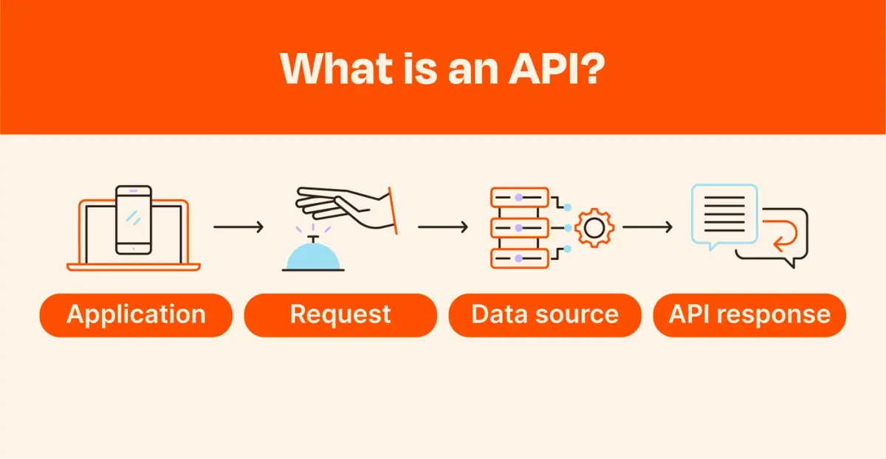
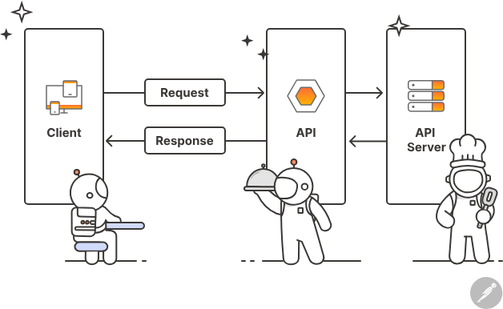
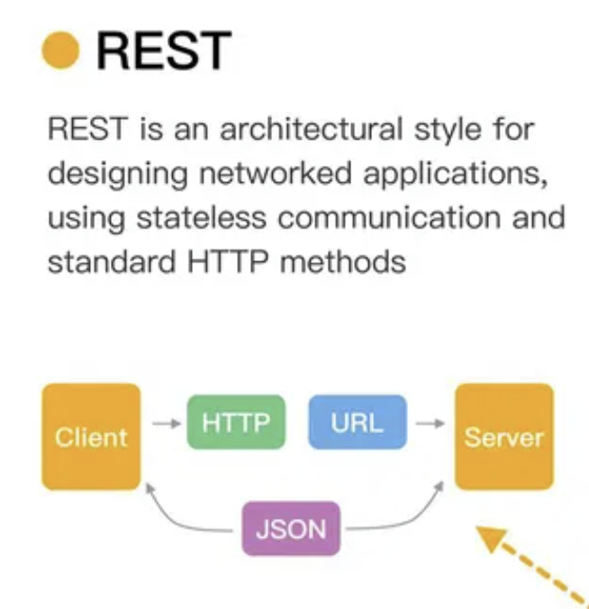
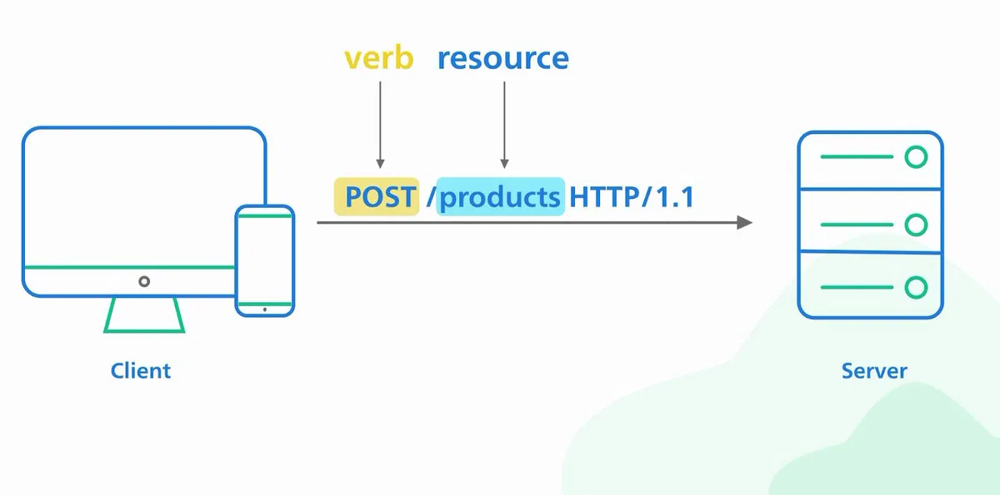
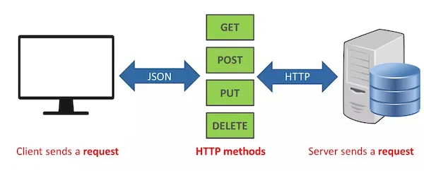
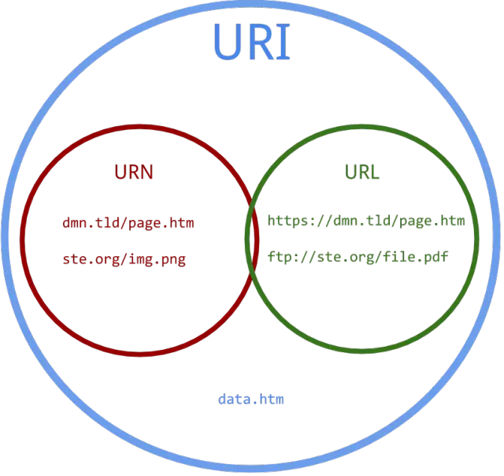
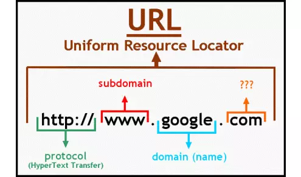

# API TRONG FLUTTER

**Tóm tắt**
- **API:** Công cụ giao tiếp giữa client và server.
- **REST:** Kiến trúc dùng HTTP để thao tác dữ liệu, thường trả về JSON.
- **Thành phần REST API:** Base URL, endpoint, phương thức HTTP, header, body, response.
- **JSON trong Flutter:** Dùng `http` để lấy dữ liệu, `dart:convert` để phân tích, và model class để ánh xạ dữ liệu vào Dart.


## I. API
[API](https://200lab.io/blog/api-la-gi)



- `API` là một tập hợp các định nghĩa và giao thức cho phép hai ứng dụng hoặc hệ thống phần mềm giao tiếp với nhau. 

- Nó đóng vai trò như một "người trung gian" giúp gửi yêu cầu (**request**) từ phía **client** (ứng dụng người dùng) đến **server** (máy chủ) và nhận phản hồi (**response**) từ server.



*Ví dụ: Công ty của bạn đang xây dựng một ứng dụng giao nhận đồ ăn, ứng dụng này được tạo thành từ nhiều Dịch vụ (Service) khác nhau : Quản lý người dùng, đơn hàng, thanh toán, ... Khi khách hàng thanh toán, dịch vụ Quản lý thanh toán sẽ giao tiếp với dịch vụ Quản lý đơn hàng để cập nhật trạng thái đơn hàng (thanh toán thành công/thất bại), nói một cách khác Payment Service sẽ gọi API của Order Service để cập nhật Order Status.*

## II. REST (Representational State Transfer)



- REST là một kiến trúc định nghĩa tiêu chuẩn giao tiếp giữa các hệ thống Web (Web API). 
- Các hệ thống tuân thủ tiêu chuẩn REST thường được gọi là RESTful, có 6 nguyên tắc mà bạn sẽ phải tuân thủ:
    - **Client-Server:** `REST` tách biệt vai trò của máy khách (`client`) và máy chủ (`server`). Máy khách chịu trách nhiệm gửi yêu cầu, trong khi máy chủ xử lý yêu cầu và trả về phản hồi. Điều này giúp phân chia trách nhiệm rõ ràng và cho phép phát triển từng thành phần độc lập.
    - **Stateless**: `REST` tuân thủ nguyên tắc không trạng thái, nghĩa là mỗi yêu cầu từ máy khách đến máy chủ phải chứa tất cả thông tin cần thiết để hiểu và xử lý yêu cầu. Máy chủ không lưu trữ trạng thái của máy khách giữa các yêu cầu, giúp hệ thống dễ mở rộng và bảo trì hơn.
    - **Cacheable**: Các phản hồi từ máy chủ có thể được gắn cờ để lưu trữ ở bộ nhớ đệm (cache) nếu thích hợp, giúp giảm tải cho máy chủ và cải thiện hiệu suất hệ thống.
    - **Uniform Interface**: `REST` sử dụng một giao diện đồng nhất để tương tác với các tài nguyên (resource). Giao diện này thường sử dụng các phương thức HTTP tiêu chuẩn như `GET`, `POST`, `PUT`, DEL`ETE, v.v., và các URIs để xác định tài nguyên.
    
    ()
    - **Layered System**: `REST` cho phép kiến trúc hệ thống được xây dựng thành các lớp, trong đó mỗi lớp có thể thực hiện một nhiệm vụ cụ thể mà không cần biết về các lớp khác. Điều này giúp tăng tính linh hoạt và khả năng mở rộng của hệ thống.
    - **Code on Demand:** `REST` có thể hỗ trợ tuỳ chọn tải thêm các tính năng về khi Client yêu cầu (khi người dùng click vào) mà không phải tải hết một lần khi bạn mở ứng dụng.



Thông qua các động từ HTTP khác nhau, Client có thể tương tác với một tài nguyên như sau:

- **GET /customers**: Lấy danh sách các khách hàng
- **GET /customer/{id}**: Lấy thông tin chi tiết của một khách hàng bằng cách sử dụng mã định danh của họ.
- **POST /customers**: Khởi tạo khách hàng mới.
- **PUT /customers/{id}**: Sửa đổi một khách hàng hiện có được xác định bởi ID của họ.
- **DELETE /customers/{id}**: Xóa một khách hàng bằng ID của họ.

## II. REST API (RESTful API)

[REST API](https://200lab.io/blog/http2-la-gi)



- `REST API` là một giao diện lập trình ứng dụng (API) tuân thủ các ràng buộc và quy ước kiến trúc **REST** được sử dụng trong việc giao tiếp giữa **client** và **server**. 

- Hiện tại, các `REST API` dùng **JSON** rất phổ biến. Một ít có thể vẫn còn dùng **XML**.

**REST API bao gồm các thành phần chính sau:**

### 1. URI (Uniform Resource Identifier)

- URI là cách để xác định tài nguyên trên server.

- Ví dụ: https://api.example.com/users có thể đại diện cho tài nguyên người dùng.

### 2. HTTP Methods (Phương thức HTTP)

- **REST API** sử dụng các phương thức HTTP để tương tác với tài nguyên:

    - **GET**: Lấy tài nguyên từ server.
    - **POST**: Tạo tài nguyên mới trên server.
    - **PUT**: Cập nhật tài nguyên hiện tại.
    - **DELETE**: Xóa tài nguyên.
    - **PATCH**: Cập nhật một phần của tài nguyên.

### 3. Headers (Tiêu đề)

- `Headers` chứa thông tin bổ sung về yêu cầu hoặc phản hồi, chẳng hạn như loại nội dung (Content-Type), mã trạng thái (Status Code), hoặc các tham số xác thực (Authentication).

- Ví dụ: `Content-Type: application/json` để thông báo rằng nội dung yêu cầu hoặc phản hồi là JSON.

### 4. Body (Thân yêu cầu)

- Yêu cầu chứa dữ liệu thực tế được gửi trong các phương thức như POST, PUT, hoặc PATCH.

- Ví dụ, khi tạo người dùng mới với phương thức POST, thân yêu cầu có thể chứa dữ liệu như tên, tuổi, email.

### 5. Status Codes (Mã trạng thái HTTP)

- Các mã trạng thái HTTP phản ánh kết quả của yêu cầu.

    - **200 OK:** Yêu cầu thành công.

    - **201 Created:** Tài nguyên đã được tạo thành công.

    - **400 Bad Request:** Yêu cầu không hợp lệ.

    - **401 Unauthorized:** Yêu cầu yêu cầu xác thực.

    - **404 Not Found:** Tài nguyên không tồn tại.

    - **500 Internal Server Error:** Lỗi phía server.

### 6. Representation (Biểu diễn tài nguyên)

- Các tài nguyên trong REST API được trình bày dưới dạng các định dạng khác nhau, phổ biến nhất là `JSON` hoặc `XML`.

- Ví dụ: Khi bạn truy vấn tài nguyên người dùng, API có thể trả về dữ liệu dưới dạng JSON như:

```json
{
  "id": 1,
  "name": "John Doe",
  "email": "john@example.com"
}
```

## III. JSON trong Flutter

- `JSON` (JavaScript Object Notation) là một định dạng dữ liệu nhẹ, dễ đọc và dễ phân tích, thường được sử dụng để trao đổi dữ liệu giữa client và server trong REST API.

- **Cấu trúc JSON:**
  - Dữ liệu dạng cặp key-value: `{"key": "value"}`.
  - Hỗ trợ các kiểu dữ liệu: chuỗi (string), số (number), boolean, null, mảng (array), và đối tượng (object).
  
  Ví dụ:
  ```json
  {
    "id": 1,
    "name": "John",
    "isActive": true,
    "scores": [85, 90, 95],
    "address": {"street": "123 Main St", "city": "Hanoi"}
  }

- **Sử dụng JSON trong Flutter:**
  Flutter không tự động hiểu JSON, nên bạn cần:
  
  1. **Gửi yêu cầu HTTP:** Dùng package `http` để gọi API và nhận dữ liệu JSON.
  2. **Phân tích JSON:** Sử dụng `dart:convert` để chuyển JSON thành đối tượng Dart.
  3. **Tạo model:** Định nghĩa các lớp Dart để ánh xạ dữ liệu JSON.

- Ví dụ cơ bản trong Flutter:

```dart
import 'dart:convert';
import 'package:http/http.dart' as http;

// Model class
class User {
  final int id;
  final String name;

  User({required this.id, required this.name});

  factory User.fromJson(Map<String, dynamic> json) {
    return User(
      id: json['id'],
      name: json['name'],
    );
  }
}

// Hàm lấy dữ liệu từ API
Future<List<User>> fetchUsers() async {
  final response = await http.get(Uri.parse('https://api.example.com/users'));
  if (response.statusCode == 200) {
    List<dynamic> jsonData = jsonDecode(response.body);
    return jsonData.map((json) => User.fromJson(json)).toList();
  } else {
    throw Exception('Failed to load users');
  }
}

// Sử dụng trong widget
void main() {
  runApp(MyApp());
}

class MyApp extends StatelessWidget {
  @override
  Widget build(BuildContext context) {
    return MaterialApp(
      home: Scaffold(
        body: FutureBuilder<List<User>>(
          future: fetchUsers(),
          builder: (context, snapshot) {
            if (snapshot.hasData) {
              return ListView.builder(
                itemCount: snapshot.data!.length,
                itemBuilder: (context, index) {
                  return ListTile(
                    title: Text(snapshot.data![index].name),
                  );
                },
              );
            } else if (snapshot.hasError) {
              return Text('Error: ${snapshot.error}');
            }
            return CircularProgressIndicator();
          },
        ),
      ),
    );
  }
}
```

```
dependencies:
  http: ^1.1.0
```

- **Giải thích:**
  
  1. **Package `http`:** Dùng để gửi yêu cầu GET đến API.
  2. **`jsonDecode`:** Chuyển chuỗi JSON thành `Map` hoặc `List` trong Dart.
  3. **Model `User`:** Ánh xạ dữ liệu JSON vào đối tượng Dart.
  4. **`FutureBuilder`:** Hiển thị dữ liệu bất đồng bộ (async) trong giao diện Flutter.


## IIII. HTTP, cURL, URI, URN, URL

### 1.  (HyperText Transfer Protocol - Giao thức truyền tải siêu văn bản) 

- `HTTP` là một trong các giao thức chuẩn về mạng Internet, được dùng để liên hệ thông tin giữa Máy cung cấp dịch vụ (Web server) và Máy sử dụng dịch vụ (Web client), là giao thức Client/Server dùng cho World Wide Web – WWW

- `HTTP` là một giao thức ứng dụng của bộ giao thức TCP/IP (các giao thức nền tảng cho Internet).

- hoạt động dựa trên mô hình **Client – Server**


### 2. cURL (Client URL):

- `cURL` là một công cụ dòng lệnh (command-line tool) và thư viện mã nguồn mở dùng để truyền dữ liệu thông qua nhiều giao thức khác nhau như HTTP, HTTPS, FTP, FTPS, SCP, SFTP, LDAP, IMAP, POP3, SMTP và nhiều giao thức khác.

- Với giao thức HTTP, `cURL` hỗ trợ việc gửi đi một request với tất cả các phương thức hiện có như GET, POST, PUT, DELETE…

- `cURL` có hỗ trợ việc truyền dữ liệu qua giao thức HTTPS. Ta có thể dùng cURL trong Php để `GET` và `POST` dữ liệu, truy cập REST API service có kết hợp với JSON hoặc xác thực OAUTH.

### 3. URI (Uniform Resource Identifier)

[link](https://viblo.asia/p/tim-hieu-ve-uri-url-va-urn-maGK7WxaKj2)


- `URI` là một chuỗi ký tự dùng để định danh (identify) hoặc định vị (locate) một tài nguyên trên mạng (ví dụ: trang web, file, dịch vụ).

- `URI` bao gồm cả URL và URN.

**Cấu trúc cơ bản của URI:**

```text
scheme:[//authority]path[?query][#fragment]
```
- **Trong đó:**
  - **scheme**: Giao thức hoặc loại định danh (ví dụ: http, mailto, urn).
  - **authority**: Thông tin về máy chủ hoặc nguồn (ví dụ: www.example.com).
  - **path**: Đường dẫn đến tài nguyên.
  - **query**: Tham số bổ sung (thường sau dấu ?).
  - **fragment**: Phần cụ thể trong tài nguyên (thường sau dấu #).

- **Ví dụ:**
  - https://www.sample.com.vn/logo.jpg  (1-5:(một URI cụ thể))
  - https://www.sample.com/logo.ico
  - https://www.sample.com/logo.png
  - ftp://sample/files/document.doc
  - https://www.sample.com
  - urn:isbn:978-0132350884 (một URI trừu tượng)

### 4. URL (Uniform Resource Locator) 

- `URL`là một tập con của URI, dùng để định vị (locate) tài nguyên trên Internet.
- `URL` luôn chỉ ra cách truy cập tài nguyên (thông qua giao thức như HTTP, FTP).



*Như ví dụ trên, URL sẽ là từ cái thứ 1 tới 5, cái mà ta có thể nhận ra được giao thức cũng như path tới tài nguyên và request trực tiếp luôn được.*

### 5.URN (Uniform Resource Name)

- `URN` là một tập con của URI, dùng để định danh (name) tài nguyên một cách duy nhất và ổn định, nhưng không chỉ ra cách truy cập.

- `URN` thường dùng trong các hệ thống quản lý tài nguyên lâu dài (ví dụ: sách, tài liệu chuẩn).

```text
urn:<namespace>:<specific-resource-identifier>
```

*ví dụ cái 6*

#### So Sánh URI, URL, URN

| Thuật ngữ    | Mục đích                               | Ví dụ                              | Có chứa vị trí truy cập? |
|--------------|----------------------------------------|------------------------------------|-------------------------|
| URI          | Định danh hoặc định vị tài nguyên      | https://example.com, urn:isbn:12345 | Có thể có hoặc không    |
| URL          | Định vị tài nguyên (cách truy cập)     | https://google.com, ftp://example.com/file.txt | Có                     |
| URN          | Định danh tài nguyên (không chỉ vị trí) | urn:isbn:12345, urn:uuid:123e4567 | Không                   |
