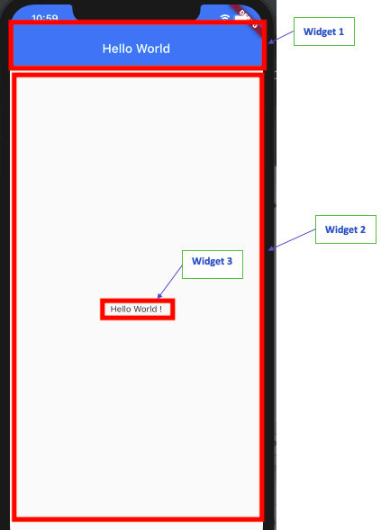
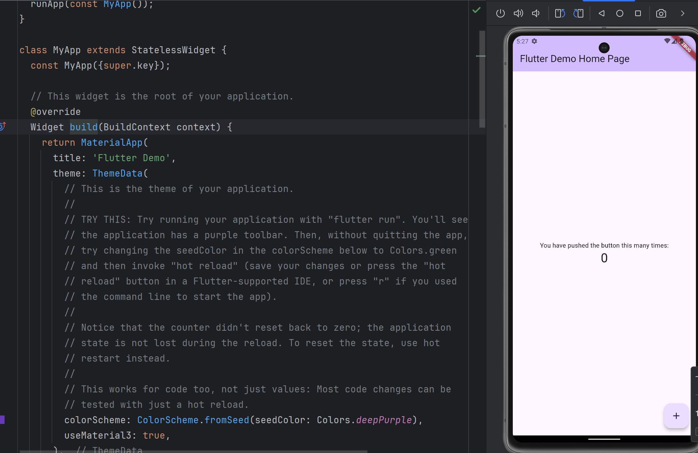
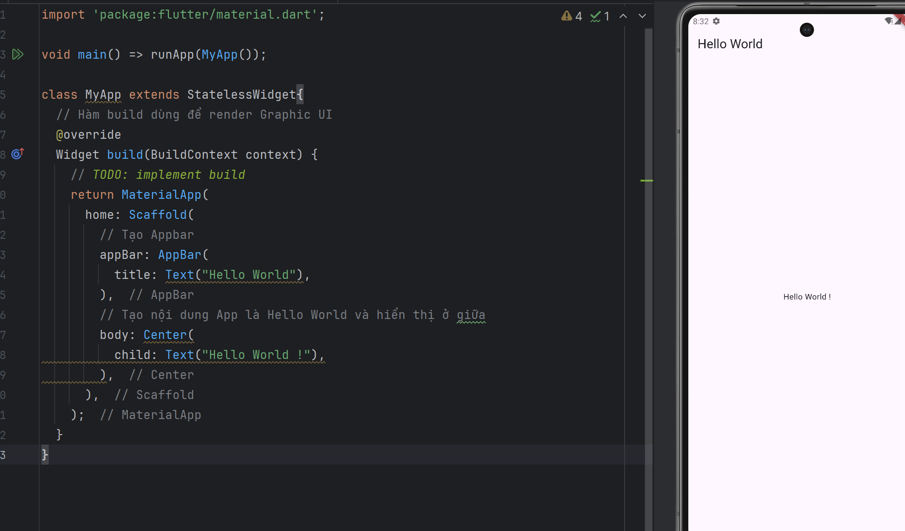
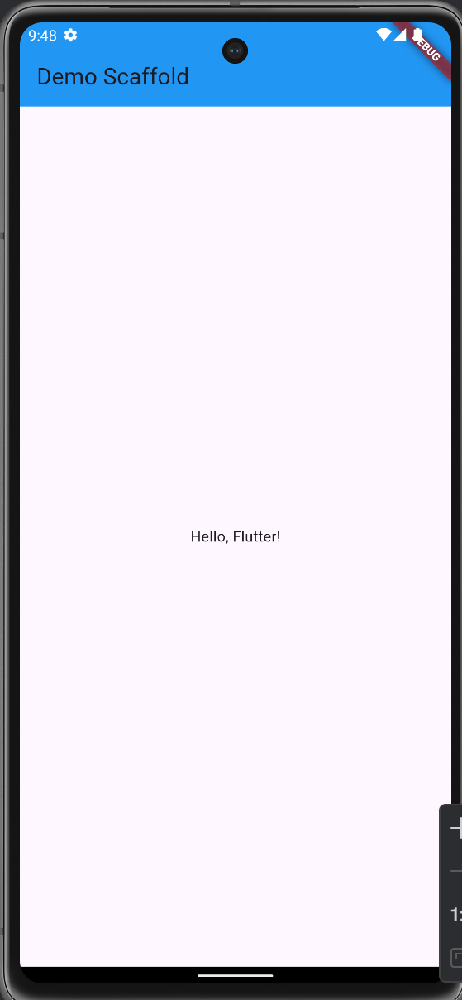
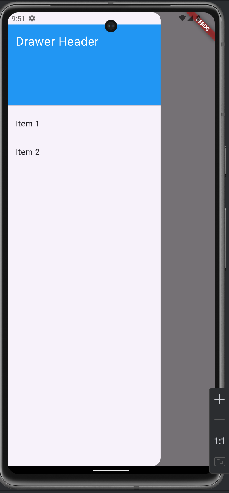
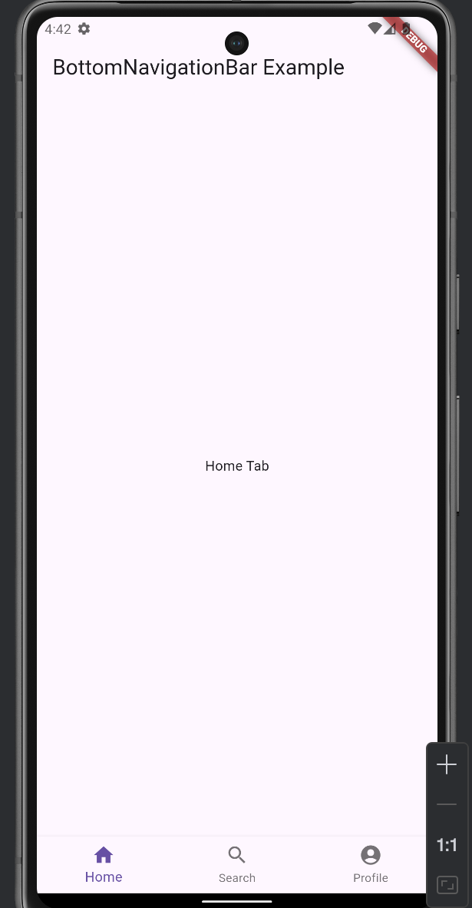
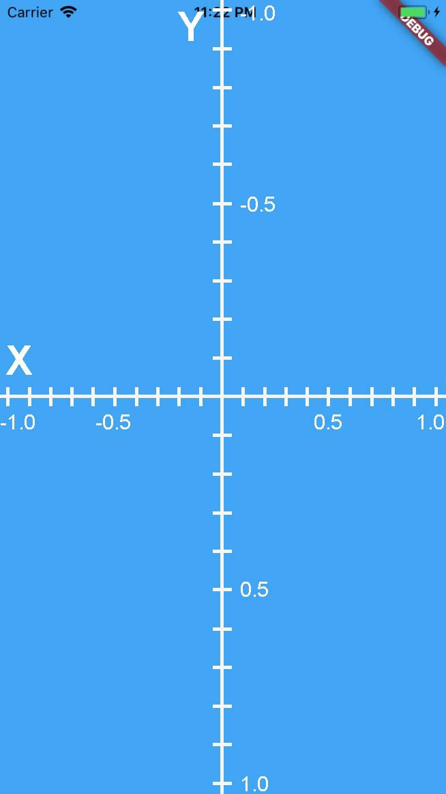
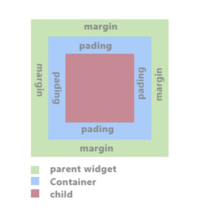
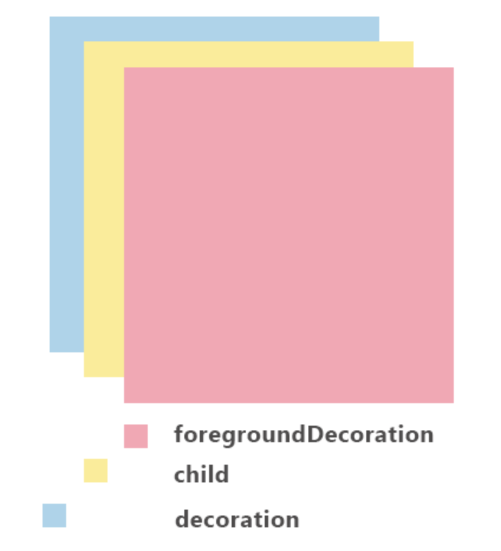
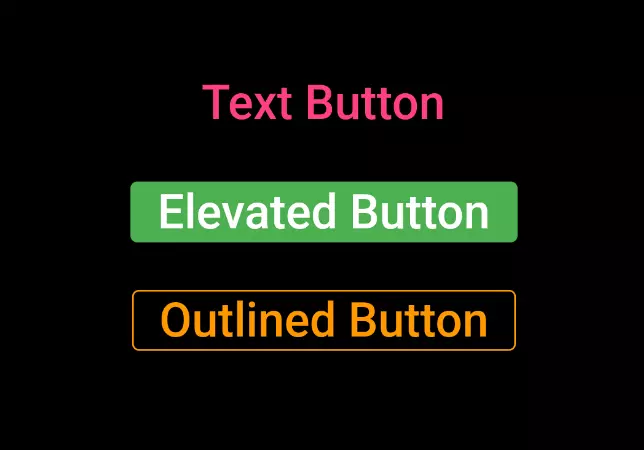

# BUOI 3:FVM, Statefull, Stateless, MaterialApp, Scaffold,...

## I.FVM (Flutter Version Management)

### [1. FVM là gì?](https://blog.haposoft.com/cu-nhung-moi-quan-ly/#:~:text=FVM%20cho%20ph%C3%A9p%20b%E1%BA%A1n%20d%E1%BB%85,c%C3%A1c%20phi%C3%AAn%20b%E1%BA%A3n%20kh%C3%A1c%20nhau.)

- `Flutter Version Management` là 1 hệ thống quản lý các phiên bản Flutter khác nhau.
- `FVM` giúp đảm bảo ứng dụng của bạn được xây dựng một cách đồng nhất bằng cách tham chiếu đến phiên bản Flutter `SDK` được sử dụng cho từng dự án cụ thể.
- Nó cũng cho phép bạn cài đặt nhiều phiên bản Flutter khác nhau để kiểm tra và thử nghiệm các phiên bản Flutter sắp tới với ứng dụng của bạn mà không phải chờ đợi quá trình cài đặt Flutter mỗi lần.

*Với Kotlin trong Android Studio, công cụ tương tự như FVM cho Flutter để quản lý các phiên bản khác nhau là SDK Manager và Gradle.*

### 2. FVM giúp khắc phục các vấn đề gì?

- **Quản lý nhiều phiên bản SDK**: FVM cho phép  có nhiều phiên bản Flutter SDK trên một hệ thống mà không gặp phải các vấn đề về tương thích hoặc cài đặt lại.
- **Chuyển đổi giữa các kênh Flutter (Channels):** Nếu cần kiểm thử các tính năng mới của SDK, FVM giúp bạn dễ dàng chuyển đổi giữa các kênh như stable, beta, dev, hoặc master mà không phải tải lại Flutter SDK mỗi lần.
- **Tiết kiệm thời gian:** Việc chuyển đổi giữa các kênh và phiên bản SDK không còn tốn thời gian nữa, vì FVM giúp bạn lưu trữ và sử dụng các phiên bản Flutter đã cài sẵn.
- **Theo dõi và quản lý phiên bản SDK:** FVM giúp bạn dễ dàng theo dõi phiên bản Flutter SDK hiện tại đang sử dụng trong dự án, giúp bạn duy trì tính đồng nhất và kiểm soát phiên bản chính xác.

## II. State, Widget, StatefulWidget, StatelessWidget, Vòng đời ứng dụng.

### 1. [Widget là gì ?](https://baoflutter.com/state-widget-statefulwidget-statelesswidget-vong-doi-ung-dung/)

- `Widget` là các “configuration object” dùng để tạo lên ứng dụng Flutter. 
  
-  Một `widget` có thể là một phần tử đơn giản (ví dụ, một đoạn văn bản), hoặc có thể là một nhóm các phần tử kết hợp với nhau (ví dụ, một màn hình chứa nhiều widget con).

- Như vậy, Tạo ứng dụng Flutter là tạo các Widget và liên kết chúng lại với nhau.



- Trong sourcecode: StatelessWidget, StatefulWidget, MaterialApp, Scaffold, Text, Button, Center, Column, Row, Container, SizedBox, ListView, GridView… đều là những Widget có sẵn trong Flutter SDK.

- Người phát triển ứng dụng có thể tự tạo các Widget dựa trên các Widget có sẵn hoặc từ các thư viện được thêm vào trong pubspec.yaml

### 2. State là gì

`State` là một số dữ liệu hoặc thông tin được ứng dụng của bạn sử dụng. Nó có thể kích hoạt quá trình rebuild giao diện người dùng hoặc các phần nhất định của giao diện người dùng dựa trên dữ liệu đã thay đổi.

*Ví dụ: Một ứng dụng đơn giản bao gồm một nút bấm (button) và một dòng Text hiển thị trên màn hình. Mỗi lần bấm nút đó thì dòng text trên màn hình lại thay đổi. Như vậy ta nói State của Text thay đổi hay State của Ứng dụng đã thay đổi mỗi khi nhấn nút.*

### [3 StatelessWidget](https://viblo.asia/p/flutter-stateful-va-stateless-widget-eW65G1oPZDO)

- `StatelessWidget` hiểu nôm na là `Widget` **tĩnh** và nó không thể tự thay đổi được những gì mà nó hiển thị sau khi đã được `Render` xong.



- `Widget` này cần 1 hàm `Widget build(BuildContext context)` để render dữ liệu lên màn hình.
- Hàm `build` chỉ được gọi 1 lần khi ứng dụng đang hoạt động, như vậy thì dữ liệu chỉ được `render` 1 và không thay đổi suốt quá trình sử dụng ứng dụng

**nên sử dụng StatelessWidget trong trường hợp nào:**
- Hiển thị dữ liệu cứng. ex: Appbar, Title của màn hình vvv
- Sử dụng trong `StatefulWidget` để khi `StatefulWidget` thay đổi trạng thái thì các item con sẽ được render lại.


### 4. StatefulWidget

- Khác với `StatelessWidget` thì `StatefulWidget` là 1 Widget động và nó có thể thay đổi những gì đang hiển thị bằng cách thay đổi `State` của chính nó.

- Widget này cần hàm `State<MyHomePage> createState()` để cung cấp State cho StatefulWidget.

```dart
import 'package:flutter/material.dart';

void main() {
  runApp(const MyApp());
}

class MyApp extends StatelessWidget {
  const MyApp({super.key});

  // This widget is the root of your application.
  @override
  Widget build(BuildContext context) {
    return MaterialApp(
      title: 'Flutter Demo',
      theme: ThemeData(
        colorScheme: ColorScheme.fromSeed(seedColor: Colors.deepPurple),
        useMaterial3: true,
      ),
      home: const MyHomePage(title: 'Flutter Demo Home Page'),
    );
  }
}

class MyHomePage extends StatefulWidget {
  const MyHomePage({super.key, required this.title});

  final String title;

  @override
  State<MyHomePage> createState() => _MyHomePageState();
}

class _MyHomePageState extends State<MyHomePage> {
  int _counter = 0;

  void _incrementCounter() {
    setState(() {
      _counter++;
    });
  }

  @override
  Widget build(BuildContext context) {
    return Scaffold(
      appBar: AppBar(
        
        backgroundColor: Theme.of(context).colorScheme.inversePrimary,
        title: Text(widget.title),
      ),
      body: Center(
        child: Column(
          mainAxisAlignment: MainAxisAlignment.center,
          children: <Widget>[
            const Text(
              'You have pushed the button this many times:',
            ),
            Text(
              '$_counter',
              style: Theme.of(context).textTheme.headlineMedium,
            ),
          ],
        ),
      ),
      floatingActionButton: FloatingActionButton(
        onPressed: _incrementCounter,
        tooltip: 'Increment',
        child: const Icon(Icons.add),
      ), // This trailing comma makes auto-formatting nicer for build methods.
    );
  }
}

```

- Class `_MyHomePageState` sẽ overrides phương thức `Widget build(BuildContext context)` hàm này trả về Widget. Đây là nơi bạn định nghĩa UI mà class hiển thị. `StatefulWidget` quản lý trạng thái UI thông qua State, khi State thay đổi thì `StatefulWidget` sẽ render lại UI mà nó đang hiển thị.

***Làm thế nào tôi có thể thay đổi được State của Statefull hay đơn giản là update dữ liệu đang hiển thị trên màn hình?***

-  `StatefulWidget` cung cấp phương thức `setState()` để bạn có thể thay đổi State của class.
-  Hiểu đơn giản là khi bạn muốn Update UI của StatefulWidget thì cần gọi phương thức setState() để thông báo cho StatefullWidget là tôi muốn bạn UpdateUI.
-  có thể gọi `setState()` nhiều lần mỗi khi cần thay đổi UI trong vòng đời của ứng dụng.

**Hàm setState() rất quan trọng trong việc thay đổi trạng thái của màn hình, giúp build lại màn hình.**

+ `StatelessWidget` : được dùng để hiển thị đơn thuần và không liên quan đến State.
+ `StatefulWidget` : được class HomePage kế thừa để thể hiện sự thay đổi của state bên trong màn hình ứng dụng.

### 5.Vòng đời ứng dụng

Khi kế thừa lớp StatelessWidget hay StatefulWidget thì đều thấy ghi đè( @override) các phương thức như : build, createState,...điều đó là dấu hiệu của vòng đời ứng dụng Flutter.

- `Vòng đời ứng dụng Flutter` là tên gọi cho một `chu trình quản lý trạng thái (State)` của một màn hình ứng dụng.
- Một ứng dụng Flutter có nhiều màn hình khác nhau và mỗi màn hình đều có sự thiết lập chu trình quản lý trạng thái ( State).

Như vậy khái niệm vòng đời ứng dụng trong Flutter, chính là vòng đời của trạng thái (State) .
Vì là quản lý theo trạng thái ( State) nên chúng ta chia làm hai loại có state ( Stateful ) và không có State (Stateless).

#### 5.1 Vòng đời ứng dụng chỉ dùng StatelessWidget

Vì chỉ sử dụng `StatelessWidget`, Màn hình ứng dụng chỉ đơn thuần là nhận và hiển thị dữ liệu, không liên quan đến State nên không có vòng đời.

Việc ghi đè (@ override ) phương thức build là dùng để render Graphic UI( user interface), hiển thị lên màn hình cho người dùng.

```dart
import 'package:flutter/material.dart';

void main() => runApp(MyApp());

class MyApp extends StatelessWidget{
  // Hàm build dùng để render Graphic UI 
  @override
  Widget build(BuildContext context) {
    // TODO: implement build
    return MaterialApp(
      home: Scaffold(
        // Tạo Appbar
        appBar: AppBar(
          title: Text("Hello World"),
        ),
        // Tạo nội dung App là Hello World và hiển thị ở giữa
        body: Center(
          child: Text("Hello World !"),
        ),
      ),
    );
  }
}
```



#### 5.2: Vòng đời sử dụng StatefulWidget

Xây dựng màn hình ứng dụng dùng StatefulWidget tức là liên quan đến việc quản lý State. Vì vậy nó cần chu trình quản lý trạng thái.

Trong một vòng đời có 7 trạng thái đó là : `createState`, `initState`, `didChangeDependences`, `build`, `didUpdateWidget`, `deactive`, `dispose`.

**createState**

- Khi tạo class kế thừa đến StatefulWidget, hàm khởi tạo sẽ được yêu cầu gọi đầu tiên, bằng cách ghi đè phương thức createState.

```dart
@override
  State<MyHomePage> createState() => _MyHomePageState();
```

hoặc:

```
State<StatefulWidget> createState() {
    // TODO: implement createState
    return _MyHomePageState();
  }
```

**initState()**

Hàm này được gọi ngay khi widget được tạo. Nếu bạn đã lập trình native Android thì nó tương tự như onCreate().

```dart
 @override
  void initState() {
    // TODO: implement initState
    super.initState();
    // Viết gì đó
  }
  ```

  **didChangeDependencies()**

  Hàm được gọi ngay sau hàm initState() và được gọi lại khi dependency của State thay đổi.

```dart

 @override
  void didChangeDependencies() {
    // TODO: implement didChangeDependencies
    super.didChangeDependencies();
  }
```

**build()**

Hàm này được gọi sau didChangeDependencies(). Tất cả graphic UI (User Interface) sẽ được render trong hàm này.

```dart
@override
  Widget build(BuildContext context) {
    // TODO: implement build
    return MaterialApp(
      home: Scaffold(
        // Tạo Appbar
        appBar: AppBar(
          title: Text("Hello World"),
        ),
        // Tạo nội dung App là Hello World và hiển thị ở giữa
        body: Center(
          child: Text("Hello World !"),
        ),
      ),
    );
  }
```

**didUpdateWidget**

Hàm này được gọi khi Widget configuration thay đổi. Sau khi hàm này được gọi thì hàm build sẽ được gọi, như vậy hàm setState được sử dụng trong hàm didUpdateWidget sẽ bị bỏ qua.

```dart
@override
  void didUpdateWidget(MyHomePage oldWidget) {
    // TODO: implement didUpdateWidget
    super.didUpdateWidget(oldWidget);
  }
```

**deactivate()**

Hàm này được gọi khi State bị gỡ khỏi cây widget nhưng nó có thể xác nhận lại trước khi quá trình xoá kết thúc.

```dart
 @override
  void deactivate() {
    // TODO: implement deactivate
    super.deactivate();
  }
```

**dispose()**

Hàm này được gọi khi State bị gỡ ngay lập tức khỏi cây widget và khi đó State không bao giờ được build trở lại.

```dart
 @override
  void dispose() {
    // TODO: implement dispose
    super.dispose();
  }
```

***kết luận***
+ Các màn hình ứng dụng Flutter được tạo bởi các Widget
+ Hàm setState trong class kế thừa StatefulWidget , giúp set lại State và build lại màn hình mỗi khi được gọi đến.
+ StatelessWidget – class kế thừa Widget này, chỉ nhận và hiển thị dữ liệu đơn thuần không liên quan đến state và không có vòng đời.
+ StatefulWidget – class kế thừa Widget này để tạo màn hình ứng dụng có vòng đời gồm 7 trạng thái là : createState, initState, didChangeDependencies, build, didUpdateWidget, deactivate, dispose.

## III. MaterialApp

`MaterialApp` trong Flutter là một widget cơ bản giúp bạn xây dựng ứng dụng với phong cách thiết kế Material Design của Google. Đây là một trong những widget quan trọng và được sử dụng phổ biến trong các ứng dụng Flutter, vì nó cung cấp các tính năng và cấu trúc cần thiết cho ứng dụng.

### 1. Chức năng chính của MaterialApp

`MaterialApp` cung cấp một bộ khung cho ứng dụng của bạn, bao gồm:

- **Điều hướng (Navigation)**: `MaterialApp` tích hợp với `Navigator`, giúp bạn quản lý các route (màn hình) trong ứng dụng.
- **Chủ đề (Theme)**: Cung cấp một cấu hình chung cho các thành phần giao diện như màu sắc, kiểu chữ, v.v.
- **Vùng (Locale)**: Hỗ trợ quốc tế hóa ứng dụng, cho phép bạn dễ dàng thay đổi ngôn ngữ và định dạng ngày tháng tùy theo vùng miền.
- **Hỗ trợ Scaffold**: Mặc dù không phải là widget Scaffold, nhưng MaterialApp cung cấp cấu trúc cho phép bạn sử dụng Scaffold để xây dựng giao diện chính của ứng dụng.

### 2. Các thuộc tính quan trọng của MaterialApp

- `title`: Tiêu đề của ứng dụng. Đây là tên ứng dụng sẽ xuất hiện trên thanh taskbar (Windows) hoặc màn hình chính (Android).

```dart
title: 'My Flutter App',
```

- `theme`: Chủ đề của ứng dụng, định nghĩa các màu sắc, kiểu chữ và các thành phần UI khác. Bạn có thể sử dụng `ThemeData` để tùy chỉnh.

```
theme: ThemeData(
  primarySwatch: Colors.blue,
  visualDensity: VisualDensity.adaptivePlatformDensity,
),
```

- `home`: Màn hình đầu tiên mà người dùng thấy khi mở ứng dụng. Thường sử dụng `Scaffold` để xây dựng giao diện của màn hình này.

```dart
home: HomePage(),
```

- `initialRoute` và `routes`: Dùng để xác định các route mặc định và các route tùy chỉnh cho ứng dụng. `MaterialApp` tự động cung cấp điều hướng dựa trên các route này.

```dart
initialRoute: '/',
routes: {
  '/home': (context) => HomePage(),
  '/settings': (context) => SettingsPage(),
},
```

- `onGenerateRoute`: Cung cấp cách để tạo route một cách động hoặc tùy chỉnh, giúp bạn kiểm soát quá trình tạo màn hình.

```dart
onGenerateRoute: (settings) {
  if (settings.name == '/details') {
    return MaterialPageRoute(builder: (context) => DetailsPage());
  }
  return null; // Trả về route mặc định nếu không tìm thấy route phù hợp.
},
```

- `navigatorKey`: Một khóa dùng để điều khiển `Navigator` của ứng dụng. Hữu ích khi bạn muốn điều hướng mà không cần sử dụng context.

```dart
navigatorKey: GlobalKey<NavigatorState>(),
```

### 3. Ví dụ sử dụng MaterialApp

Dưới đây là một ví dụ đơn giản về cách sử dụng `MaterialApp` trong Flutter:

```dart
import 'package:flutter/material.dart';

void main() {
  runApp(MyApp());
}

class MyApp extends StatelessWidget {
  @override
  Widget build(BuildContext context) {
    return MaterialApp(
      title: 'Flutter Demo',
      theme: ThemeData(
        primarySwatch: Colors.blue,
      ),
      home: MyHomePage(),
    );
  }
}

class MyHomePage extends StatelessWidget {
  @override
  Widget build(BuildContext context) {
    return Scaffold(
      appBar: AppBar(
        title: Text('Welcome to Flutter'),
      ),
      body: Center(
        child: Text('Hello, world!'),
      ),
    );
  }
}
```

## IV. Scaffold

### [Scaffold là gì?](https://salesoft.vn/tin-tuc/tim-hieu-lop-scaffold-va-cac-thanh-phan-trong-flutter#scaffold-l%C3%A0-g%C3%AC?)

- `Scaffold` là một trong những widget cơ bản và quan trọng nhất trong Flutter, giúp xây dựng bố cục giao diện người dùng (UI) cho các ứng dụng di động.
- Nó đóng vai trò là một khung xương cho toàn bộ ứng dụng, bao gồm các phần tử như:

  - `AppBar`: Thanh tiêu đề ở đầu màn hình.
  - `Drawer`: Một bảng điều khiển trượt từ cạnh màn hình.
  - `FloatingActionButton`: Nút nổi thường dùng để thực hiện các hành động chính trong ứng dụng.
  - `BottomNavigationBar`: Thanh điều hướng dưới cùng.
  - `Body`: Nội dung chính của ứng dụng.

### 1. AppBar

`AppBar` là thanh tiêu đề trên cùng của ứng dụng, thường chứa tiêu đề hoặc các hành động như nút tìm kiếm, cài đặt.

```dart
import 'package:flutter/material.dart';

void main() {
  runApp(MyApp());
}

class MyApp extends StatelessWidget {
  @override
  Widget build(BuildContext context) {
    return MaterialApp(
      home: Scaffold(
        appBar: AppBar(
          title: Text('Demo Scaffold'),
          backgroundColor: Colors.blue,
        ),
        body: Center(
          child: Text('Hello, Flutter!'),
        ),
      ),
    );
  }
}
```

*Trong ví dụ trên, một `AppBar` được thêm vào với tiêu đề "Demo Scaffold" và màu nền xanh dương.*



### 2. Drawer

`Drawer` là bảng điều khiển trượt từ bên trái hoặc bên phải của màn hình, cho phép người dùng điều hướng qua các phần khác của ứng dụng.

```dart
import 'package:flutter/material.dart';

void main() {
  runApp(MyApp());
}

class MyApp extends StatelessWidget {
  @override
  Widget build(BuildContext context) {
    return MaterialApp(
      title: 'Drawer Example',
      home: Scaffold(
        appBar: AppBar(
          title: Text('Drawer Example'),
        ),
        drawer: Drawer(
          child: ListView(
            children: <Widget>[
              // Drawer header
              DrawerHeader(
                child: Text(
                  'Drawer Header',
                  style: TextStyle(
                    color: Colors.white,
                    fontSize: 24,
                  ),
                ),
                decoration: BoxDecoration(
                  color: Colors.blue,
                ),
              ),
              // Item 1
              ListTile(
                title: Text('Item 1'),
                onTap: () {
                  // Handle navigation
                  print('Item 1 tapped');
                  Navigator.pop(context);  // Close the drawer
                },
              ),
              // Item 2
              ListTile(
                title: Text('Item 2'),
                onTap: () {
                  // Handle navigation
                  print('Item 2 tapped');
                  Navigator.pop(context);  // Close the drawer
                },
              ),
            ],
          ),
        ),
        body: Center(
          child: Text('Content goes here'),
        ),
      ),
    );
  }
}
```



### 3. FloatingActionButton

`FloatingActionButton` là một nút nổi thường được sử dụng để thực hiện các hành động chính, ví dụ như thêm mới hoặc gửi.

```dart
import 'package:flutter/material.dart';

void main() {
  runApp(MyApp());
}

class MyApp extends StatelessWidget {
  @override
  Widget build(BuildContext context) {
    return MaterialApp(
      home: Scaffold(
        appBar: AppBar(
          title: Text('FAB Example'),
        ),
        body: Center(
          child: Text('Click the floating button!'),
        ),
        floatingActionButton: FloatingActionButton(
          onPressed: () {
            print('Floating button pressed');
          },
          child: Icon(Icons.add),
          backgroundColor: Colors.blue,
        ),
      ),
    );
  }
}
```

### 4. BottomNavigationBar

`BottomNavigationBar` là một thanh điều hướng nằm ở dưới cùng của màn hình, cho phép người dùng chuyển đổi giữa các tab hoặc màn hình khác nhau.

```dart
import 'package:flutter/material.dart';

void main() {
  runApp(MyApp());
}

class MyApp extends StatefulWidget {
  @override
  _MyAppState createState() => _MyAppState();
}

class _MyAppState extends State<MyApp> {
  int _selectedIndex = 0;

  // Danh sách các widget sẽ được hiển thị cho mỗi tab
  final List<Widget> _widgetOptions = <Widget>[
    Center(child: Text('Home Tab')),
    Center(child: Text('Search Tab')),
    Center(child: Text('Profile Tab')),
  ];

  void _onItemTapped(int index) {
    setState(() {
      _selectedIndex = index; // Cập nhật chỉ số tab được chọn
    });
  }

  @override
  Widget build(BuildContext context) {
    return MaterialApp(
      home: Scaffold(
        appBar: AppBar(
          title: Text('BottomNavigationBar Example'),
        ),
        body: _widgetOptions.elementAt(_selectedIndex), // Hiển thị widget tương ứng với tab
        bottomNavigationBar: BottomNavigationBar(
          currentIndex: _selectedIndex, // Chỉ số tab hiện tại
          onTap: _onItemTapped, // Hàm xử lý sự kiện khi người dùng chọn tab
          items: const <BottomNavigationBarItem>[
            BottomNavigationBarItem(
              icon: Icon(Icons.home),
              label: 'Home',
            ),
            BottomNavigationBarItem(
              icon: Icon(Icons.search),
              label: 'Search',
            ),
            BottomNavigationBarItem(
              icon: Icon(Icons.account_circle),
              label: 'Profile',
            ),
          ],
        ),
      ),
    );
  }
}

```



### 6. BottomSheet

`BottomSheet` là một bảng hoặc danh sách có thể kéo lên từ dưới màn hình, giúp hiển thị các thông tin bổ sung hoặc các hành động tương tác.


## V. Container

`Container` là một widget cơ bản và rất phổ biến, dùng để chứa và định dạng các widget con. Nó không chỉ giúp bạn bố trí các widget trong giao diện mà còn cho phép bạn thiết lập các thuộc tính như kích thước, màu sắc, bo góc, viền, padding, margin, và nhiều thuộc tính khác.

### 1. [Container](https://viblo.asia/p/flutter-widget-container-LzD5dewEKjY)

- khởi tạo một container.

```dart
import 'package:flutter/cupertino.dart';
import 'package:flutter/material.dart';

main() {
  runApp(App());
}

class App extends StatelessWidget {
  @override
  Widget build(BuildContext context) {
    return Center(
      child: Container(
        color: Colors.green,
      ),
    );
  }
}
```

### 2. width & height

- Định nghĩa kích thước của container

```dart
      child: Container(
        color: Colors.green,
        width: 200,
        height: 300,
      )
```

### 3. child

- Nếu không có `child` thì container sẽ có kích thước lớn nhất có thể. Nếu có child thì container sẽ theo kích thước child của nó.


#### Container không có child

```dart
      child: Container(
        color: Colors.green,
      ),
```

#### Container có child

```dart
    return Center(
      child: Container(
        color: Colors.green,
        child: Text(
          'Hello container',
          textDirection: TextDirection.ltr,
        ),
      ),
    );
```

hay 
```dart
return Center(
      child: Container(
        color: Colors.green,
        child: SizedBox(
          width: 200,
          height: 300,
        ),
      ),
    );
```

### 4. color

- Sử dụng Color class hoặc Colors class để thêm background color cho container.

```dart
      child: Container(
        color: Colors.green,
        child: SizedBox(
          width: 200,
          height: 300,
        ),
      )
```

hoặc

```dart
      child: Container(
        color: Color.fromARGB(255, 0, 0, 255),
        child: SizedBox(
          width: 200,
          height: 300,
        ),
      )
```

### 5. aligment

Sử dụng thuộc tính aligment để đặt vị trí cho child widget của container

Các class có thể dùng làm giá trị của aligment là:

- `Aligment` sử dụng hệ tọa độ với điểm gốc (0, 0) là center của container
- `AlignmentDirectional` sử dụng hệ tọa độ với điểm gốc (0, 0) là center của container, tuy nhiên phụ thuộc vàochiều viết, ví dụ ltr(Left-to-Righ) thì start ở bên trái và end bên phải, rtl thì start ở bên phải và end ở bên trái
- `FractionalOffset` sử dụng hệ tọa độ với điểm gốc (0, 0) là top left của container

Bạn có thể tạo mới Aligment với giá trị x, y mong muốn hoặc sử dụng các hằng số có sẵn.

```dart
      child: Container(
        color: Colors.green,
        child: Text(
          'Hello container',
          textDirection: TextDirection.ltr,
        ),
        alignment: Alignment(-1, -1),
      )
```

```dart
      child: Container(
        color: Colors.green,
        child: Text(
          'Hello container',
          textDirection: TextDirection.ltr,
        ),
        alignment: Alignment.centerLeft,
      )
```

Chi tiết về giá trị x, y của Aligment các bạn có thể xem tương ứng như trong hình bên dưới



### 6. constraints

Thuộc tính `constraints` định nghĩa ràng buộc về kích thước của `container`. Thường chúng ta sẽ sử dụng `BoxConstraints`.

```dart
      child: Container(
        color: Colors.green,
        alignment: AlignmentDirectional.centerStart.resolve(TextDirection.ltr),
        constraints: BoxConstraints(
          maxHeight: 400,
          maxWidth: 300,
        ),
      )
```

### 7. margin & padding

Định nghĩa khoảng cách giữa biên của container với parent bằng margin và với child bằng padding



```dart
        class App extends StatelessWidget {
  @override
  Widget build(BuildContext context) {
    return MaterialApp(
      home: Scaffold(
        body: Center(
          child: Container(
            color: Colors.green,
            margin: EdgeInsets.symmetric( // margin theo direction
              vertical: 20,
              horizontal: 30,
            ),
            padding: EdgeInsets.only(left: 20), // padding biên chỉ định
            child: Text(
              'Hello container',
              style: TextStyle(color: Colors.white),
            ),
          ),
        ),
      ),
    );
  }
}

```

### 8. decoration & foregroundDecoration

Gán một số thuộc tính về UI cho container, thứ tự ưu tiên của decoration và child được mô tả như hình vẽ dưới.



#### BoxDecoration

**color**

Sử dụng để set color cho box, dùng Color class hoặc Colors class giống như container

```dart
        decoration: BoxDecoration(
            color: Colors.blue,
        )
```

**image**
Dùng image để làm background cho box, image sẽ nằm trên color

```dart
      child: Container(
        width: 200,
        height: 300,
        decoration: BoxDecoration(
          color: Colors.blue,
          image: DecorationImage(
            fit: BoxFit.fitWidth,
            image: NetworkImage(
              'https://flutter.io/images/catalog-widget-placeholder.png',
            ),
          ),
        ),
      )
```

**border**

Set border cho box

```dart
      child: Container(
        width: 200,
        height: 300,
        decoration: BoxDecoration(
          color: Colors.blue,
          image: DecorationImage(
            fit: BoxFit.fitWidth,
            image: NetworkImage(
              'https://flutter.io/images/catalog-widget-placeholder.png',
            ),
          ),
          border: Border.all(
            width: 10,
            color: Colors.green,
          ),
        ),
      )
```

**borderRadius**

Set radius cho border của box

```dart
      child: Container(
        width: 200,
        height: 300,
        decoration: BoxDecoration(
          color: Colors.blue,
          image: DecorationImage(
            fit: BoxFit.fitWidth,
            image: NetworkImage(
              'https://flutter.io/images/catalog-widget-placeholder.png',
            ),
          ),
          border: Border.all(
            width: 10,
            color: Colors.green,
          ),
          borderRadius: BorderRadius.all(
            Radius.circular(20),
          ),
        ),
      )
```

**shape**

Set shape cho box, nhận giá trị `BoxShape.rectangle` hoặc `BoxShape.circle`

**boxShadow**
Set shadow cho box

**gradient**
Set gradient background cho box

**backgroundBlendMode**
Chế độ trộng background ảnh hưởng tới decoration, foregroundDecoration, child của Container đó


### 9. transform

Sử dụng thuộc tính này để thực hiện chuyển đổi container, truyền vào là Matrux class

```dart
child: Container(
        width: 200,
        height: 300,
        decoration: BoxDecoration(
            color: Colors.blue,
        ),
        transform: Matrix4.rotationX(pi/4),
      )

  
```

## VI.Text

```dart
class App extends StatelessWidget {
  @override
  Widget build(BuildContext context) {
    return MaterialApp(
      home: Scaffold(
        body: Center(
          child: Text(
            'Helllloo',
            textDirection: TextDirection.ltr,
            textAlign: TextAlign.left,
          ),
        ),
      ),
    );
  }
}

```

[5 thuộc tính hay được sử dụng nhất:](https://viblo.asia/p/text-and-textstyle-in-flutter-aWj53N6pl6m)
- textAlign
- overflow
- maxLines
- textScaleFactor
- style

## VI.TextField 

[Giới thiệu về TextField](https://viblo.asia/p/tim-hieu-sau-hon-ve-textfield-trong-flutter-YWOZr8BR5Q0)


```dart
void main() {
  runApp(App());
}

class App extends StatelessWidget {
  @override
  Widget build(BuildContext context) {
    return MaterialApp(
      home: Scaffold(
        appBar: AppBar(
          title: Text('Simple TextField'),
        ),
        body: Center(
          child: TextField(
            decoration: InputDecoration(
              labelText: 'Enter text',
              border: OutlineInputBorder(),
            ),
          ),
        ),
      ),
    );
  }
}
```

## VII. Button
[Các loại nút trong Flutter](https://viblo.asia/p/flutter-material-buttons-20-text-button-elevated-button-outlined-button-RnB5ppO75PG)

### Color



**Text Button**


```dart
class App extends StatelessWidget {
  @override
  Widget build(BuildContext context) {
    return MaterialApp(
      home: Scaffold(
        body: Center(
          child: TextButton(
            style: TextButton.styleFrom(
              backgroundColor: Colors.pinkAccent, // màu nền của button
              foregroundColor: Colors.white, // màu chữ (foreground)
            ),
            onPressed: () {},
            child: Text('Text Button', style: TextStyle(fontSize: 28)),
          ),
        ),
      ),
    );
  }
}
```

### Padding

```dart
child: ElevatedButton(
            style: ElevatedButton.styleFrom(
              backgroundColor: Colors.pinkAccent, 
              foregroundColor: Colors.white, 
              padding: EdgeInsets.symmetric(horizontal: 32, vertical: 8), //padding
            ),
            onPressed: () {
              print('hello');
            },
            child: Text('Elevated Button', style: TextStyle(fontSize: 28)),
          ),
```

### Size

```dart
child: ElevatedButton(
            style: ElevatedButton.styleFrom(
              backgroundColor: Colors.pinkAccent,
              foregroundColor: Colors.white,
              minimumSize: Size(240, 80), //SIZE
            ),
            onPressed: () {
              print('hello');
            },
            child: Text('Elevated Button', style: TextStyle(fontSize: 28)),
          ),
```

*Size(240, 80) có nghĩa là nút sẽ có chiều rộng tối thiểu là 240 và chiều cao tối thiểu là 80, nhưng nếu nội dung của nút lớn hơn, kích thước của nút sẽ tự động thay đổi theo nội dung.*

### Shadow

**2 thuộc tính chính: **
- `elevation` :Là thuộc tính giúp tạo shadow cho button 
- `shadowColor`: Color của shadow

```dart
style: ElevatedButton.styleFrom(
              backgroundColor: Colors.pinkAccent,
              foregroundColor: Colors.white,
              elevation: 8,
              shadowColor: Colors.blue.withOpacity(0.5),
            ),
```

### Border

Thuộc tính side: BorderSide(width, color)

```dart
style: ElevatedButton.styleFrom(
              backgroundColor: Colors.pinkAccent,
              foregroundColor: Colors.white,
              side: BorderSide(width: 2, color: Colors.blue),
            ),
```

### Shape

```dart
style: ElevatedButton.styleFrom(
              backgroundColor: Colors.pinkAccent,
              foregroundColor: Colors.white,
              shape: RoundedRectangleBorder(
                borderRadius: BorderRadius.circular(16),
              ),
            ),
```

###  Thêm Icon cho Button

```dart
child: TextButton.icon(
            style: TextButton.styleFrom(
              backgroundColor: Colors.pinkAccent,
              foregroundColor: Colors.white,
              shape: RoundedRectangleBorder(
                borderRadius: BorderRadius.circular(6),
              ),
            ),
            onPressed: () {
              print('hello');
            },
            icon: Icon(
              Icons.add,
              size: 30,
            ),
            label: Text('Elevated Button', style: TextStyle(fontSize: 28)),
          ),
```

## VIII. Column, Row, Stack

### 1. Column, Row

Đây là [2 widget](https://viblo.asia/p/nhung-widget-co-ban-trong-flutter-1Je5Eygy5nL) giúp định hình 1 tập hợp các widget theo chiều dọc (`vertically`) hoặc chiều ngang (`horizontally`)


```dart
import 'package:flutter/material.dart';

void main() {
  runApp(MaterialApp(
    home: SafeArea(
      child: Scaffold(
        body: App(),
      ),
    ),
  ));
}

class App extends StatelessWidget {
  @override
  Widget build(BuildContext context) {
    return Container(
      child: Column(
        children: [
          Row(
            children: [
              Text('ahihihi', style: TextStyle(fontSize: 40)),
              SizedBox(width: 20),
              Text('ahohohho', style: TextStyle(fontSize: 40))
            ],
          ),
          Row(
            mainAxisAlignment: MainAxisAlignment.spaceAround,
            children: [
              Text('hihi', style: TextStyle(fontSize: 40)),
              SizedBox(width: 20),
              Text('hoho', style: TextStyle(fontSize: 40))
            ],
          )
        ],
      ),
    );
  }
}
```

### 2. Stack

```dart
import 'package:flutter/material.dart';

void main() {
  runApp(MaterialApp(
    home: SafeArea(
      child: Scaffold(
        body: App(),
      ),
    ),
  ));
}

class App extends StatelessWidget {
  @override
  Widget build(BuildContext context) {
    return Container(
      color: Colors.white, // Màu nền của container
      child: Stack(
        children: [
          // Mảng widget đầu tiên (nền)
          Positioned(
            left: 50,
            top: 50,
            child: Container(
              width: 200,
              height: 200,
              color: Colors.blue, // Ô vuông màu xanh
            ),
          ),
          // Mảng widget thứ hai (ở trên cùng của widget đầu tiên)
          Positioned(
            left: 100,
            top: 100,
            child: Container(
              width: 200,
              height: 200,
              color: Colors.red, // Ô vuông màu đỏ
            ),
          ),
          // Mảng widget thứ ba (ở trên cùng của các widget trước đó)
          Positioned(
            left: 150,
            top: 150,
            child: Container(
              width: 200,
              height: 200,
              color: Colors.green, // Ô vuông màu xanh lá
            ),
          ),
          // Một widget text nằm trên cùng
          Positioned(
            left: 180,
            top: 180,
            child: Text(
              'Flutter Stack',
              style: TextStyle(fontSize: 24, color: Colors.white),
            ),
          ),
        ],
      ),
    );
  }
}
```