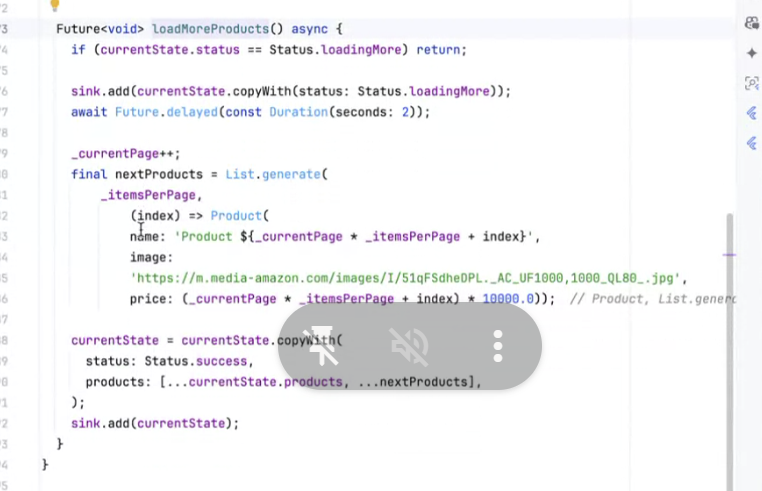
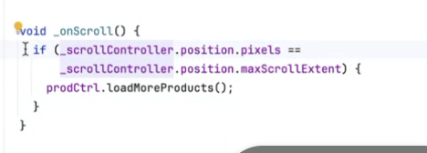

# Future builder và stream builder

- Trong Flutter, [`FutureBuilder` và `StreamBuilder`](https://dev.to/yohanym95/futurebuilder-and-streambuilder-in-flutter-g6m) là hai widget được sử dụng để xây dựng giao diện động dựa trên dữ liệu bấy đồng bộ. 

- Cả hai đều hữu ích khi làm việc với dữ liệu hoặc trạng thái bất đồng bộ, nhưng chúng phục vụ cho các mục đích khác nhau.


[Flutter Future Builder API](https://www.youtube.com/watch?v=A6Qjy0ULDNM)

## I. Future builder 

###  FutureBuilder là gì?

- `FutureBuilder` là một widget trong Flutter, được sử dụng để xử lý các hoạt động bất đồng bộ thông qua Future. 
- Widget này giúp xác định trạng thái hiện tại của `Future` và cho phép bạn hiển thị giao diện khác nhau dựa trên các trạng thái như: khi dữ liệu đang tải, khi dữ liệu đã có sẵn, hoặc khi xảy ra lỗi.

**FutureBuilder yêu cầu 2 tham số:**

`future:`
- Là dữ liệu bất đồng bộ mà FutureBuilder theo dõi.
- Gắn kết logic tải dữ liệu với widget.

`builder:`
- Hàm xây dựng giao diện, cung cấp `BuildContext` và `AsyncSnapshot`
- Quyết định giao diện khi đang tải, gặp lỗi, hoặc khi dữ liệu đã sẵn sàng.

```dart
FutureBuilder<String>(
  future: fetchData(), // Hàm trả về Future
  builder: (BuildContext context, AsyncSnapshot<String> snapshot) {
    if (snapshot.connectionState == ConnectionState.waiting) {
      return CircularProgressIndicator(); // Hiển thị khi đang chờ
    } else if (snapshot.hasError) {
      return Text('Error: ${snapshot.error}');
    } else {
      return Text('Data: ${snapshot.data}');
    }
  },
);
```

**Khi nào dùng:**

- Khi cần xử lý dữ liệu không đồng bộ chỉ xảy ra một lần hoặc trong một khoảng thời gian cụ thể.

- Ví dụ: Lấy dữ liệu từ API, đọc file, hoặc truy vấn cơ sở dữ liệu.


```dart
import 'package:flutter/material.dart';

void main() {
  runApp(const MyApp());
}

class MyApp extends StatelessWidget {
  const MyApp({super.key});

  @override
  Widget build(BuildContext context) {
    return const MaterialApp(
      home: FutureBuilderExample(),
    );
  }
}

class FutureBuilderExample extends StatefulWidget {
  const FutureBuilderExample({super.key});

  @override
  State<StatefulWidget> createState() {
    return _FutureBuilderExampleState();
  }
}

class _FutureBuilderExampleState extends State<FutureBuilderExample> {
  Future<List<String>> fetchNames() async {
    await Future.delayed(const Duration(seconds: 5));
    return ["Student1", "Student2", "Student3", "Student4"];
  }

  @override
  Widget build(BuildContext context) {
    return Scaffold(
      appBar: AppBar(
        title: const Text('FutureBuilder Example'),
      ),
      body: Center(
        child: FutureBuilder<List<String>>(
          future: fetchNames(),
          builder: (context, snapshot) {
            if (snapshot.connectionState == ConnectionState.waiting) {
              return const CircularProgressIndicator(); // dang tai
            } else if (snapshot.hasError) {
              return Text('Error: ${snapshot.error}'); //th loi
            } else {
              return ListView.builder(
                // show ds
                itemCount: snapshot.data!.length,
                itemBuilder: (context, index) {
                  return ListTile(
                    title: Text(snapshot.data![index]),
                  );
                },
              );
            }
          },
        ),
      ),
    );
  }
}
```

## II.StreamBuilder 

- `StreamBuilder` là một widget trong Flutter, được thiết kế để lắng nghe các giá trị từ một `Stream`.

**Cách hoạt động**

- `StreamBuilder` sẽ lắng nghe một Stream.
- Mỗi lần Stream phát ra một sự kiện mới, `StreamBuilder` sẽ xây dựng lại giao diện.

**Thuộc tính chính**
- `stream`: Một đối tượng Stream để StreamBuilder lắng nghe.
- `builder`: Hàm xây dựng giao diện, cung cấp `BuildContext` và `AsyncSnapshot`.

```dart
StreamBuilder<int>(
  stream: counterStream, // Hàm trả về Stream
  builder: (BuildContext context, AsyncSnapshot<int> snapshot) {
    if (snapshot.connectionState == ConnectionState.waiting) {
      return CircularProgressIndicator(); // Đang chờ stream bắt đầu
    } else if (snapshot.hasError) {
      return Text('Error: ${snapshot.error}');
    } else {
      return Text('Counter: ${snapshot.data}');
    }
  },
);
```

## So sánh FutureBuilder và StreamBuilder

| Đặc điểm               | FutureBuilder                            | StreamBuilder                          |
|------------------------|------------------------------------------|----------------------------------------|
| Dữ liệu                | Xử lý một lần (single asynchronous task) | Xử lý liên tục (data stream)           |
| Đầu vào                | `Future`                                 | `Stream`                               |
| Kết quả                | Một kết quả duy nhất                     | Nhiều kết quả theo thời gian           |
| Ứng dụng               | Gọi API, đọc file, truy vấn một lần      | Lắng nghe WebSocket, sự kiện thời gian thực |


```dart
import 'package:flutter/material.dart';

void main() {
  runApp(const MyApp());
}

class MyApp extends StatelessWidget {
  const MyApp({super.key});

  @override
  Widget build(BuildContext context) {
    return const MaterialApp(
      home: StreamBuilderExample(),
    );
  }
}

class StreamBuilderExample extends StatefulWidget {
  const StreamBuilderExample({super.key});

  @override
  State<StatefulWidget> createState() {
    return _StreamBuilderExample();
  }
}

class _StreamBuilderExample extends State<StreamBuilderExample> {
  Stream<List<String>> fetchNamesStream() async* {
    await Future.delayed(const Duration(seconds: 5));
    yield ["Student1", "Student2", "Student3", "Student4"];
  }

  @override
  Widget build(BuildContext context) {
    return Scaffold(
      appBar: AppBar(
        title: const Text("StreamBuilder Example"),
      ),
      body: Center(
        child: StreamBuilder<List<String>>(
            stream: fetchNamesStream(),
            builder: (context, snapshot) {
              if (snapshot.connectionState == ConnectionState.waiting) {
                return const CircularProgressIndicator(); // load
              } else if (snapshot.hasError) {
                return Text('Error: ${snapshot.error}'); // show loi
              } else {
                return ListView.builder(
                  // show ds
                  itemCount: snapshot.data!.length,
                  itemBuilder: (context, index) {
                    return ListTile(
                      title: Text(snapshot.data![index]),
                    );
                  },
                );
              }
            }),
      ),
    );
  }
}
```

# BTVN

# Note

- không nên để Future bên trong future 

- Cách dùng Stream nhiều lần:

```dart
import 'dart:async';

import 'package:flutter/material.dart';

void main() {
  runApp(const MyApp());
}

class MyApp extends StatelessWidget {
  const MyApp({super.key});

  @override
  Widget build(BuildContext context) {
    return const MaterialApp(
      home: StreamBuilderExample(),
    );
  }
}

class StreamBuilderExample extends StatefulWidget {
  const StreamBuilderExample({super.key});

  @override
  State<StatefulWidget> createState() {
    return _StreamBuilderExample();
  }
}

class _StreamBuilderExample extends State<StreamBuilderExample> {
  Stream<List<String>> fetchNamesStream() async* {
    await Future.delayed(const Duration(seconds: 5));
    yield List.generate(100, (index) {
      return index.toString();
    });
  }

  late final x = fetchNamesStream();

  late final StreamController<List<String>> _controller =
      StreamController<List<String>>.broadcast()..addStream(x); //

  @override
  void initState() {
    super.initState();
    _controller.stream.listen(
      (event) {},
    );
  }

  @override
  Widget build(BuildContext context) {
    return Scaffold(
      appBar: AppBar(
        title: const Text("StreamBuilder Example"),
      ),
      body: Center(
        child: StreamBuilder<List<String>>(
            stream: _controller.stream,
            builder: (context, snapshot) {
              if (snapshot.connectionState == ConnectionState.waiting) {
                return const CircularProgressIndicator(); // load
              } else if (snapshot.hasError) {
                return Text('Error: ${snapshot.error}'); // show loi
              } else {
                return ListView.builder(
                  // show ds
                  itemCount: snapshot.data!.length,
                  itemBuilder: (context, index) {
                    return ListTile(
                      title: Text(snapshot.data![index]),
                    );
                  },
                );
              }
            }),
      ),
      floatingActionButton: FloatingActionButton(onPressed: () {
        setState(() {});
      }),
    );
  }
}
```


**single state**

**multi state**

**sink**

 // cuon den cuoi cung