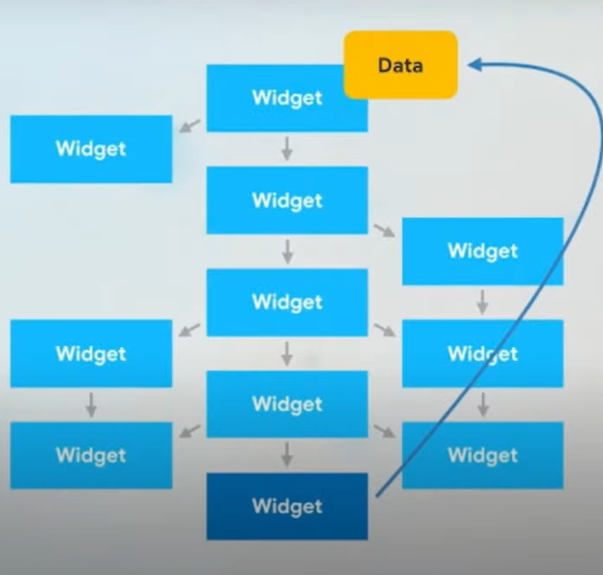
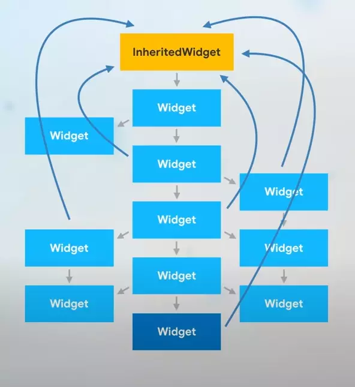
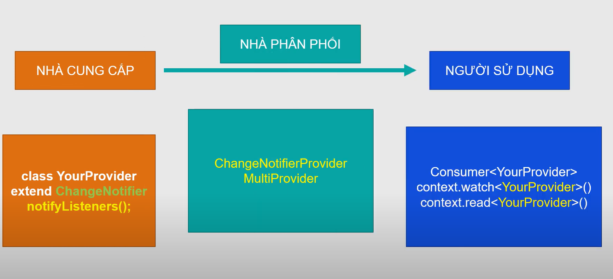

# InheritedWidget và Provider

## I. InheritedWidget

[Tổng quan](https://www.dhiwise.com/post/simplifying-state-management-in-flutter-inheritedwidget)

[1](https://viblo.asia/p/hoc-flutter-tu-co-ban-den-nang-cao-phan-4-lot-tran-inheritedwidget-3P0lPDbmlox)


- truyền data từ widget cha xuống Widget con thông qua constructor (Passing state down)

```dart
import 'package:flutter/material.dart';

class Parent extends StatefulWidget {
  const Parent({super.key});

  @override
  State<Parent> createState() => _ParentState();
}

class _ParentState extends State<Parent> {
  String string = "Trajo";

  @override
  Widget build(BuildContext context) {
    return MaterialApp(
      home: Child(
        string: string,
      ),
    );
  }
}

class Child extends StatelessWidget {
  final String string;
  const Child({super.key, required this.string});

  @override
  Widget build(BuildContext context) {
    return ChildOfChild(
      string: string,
    );
  }
}

class ChildOfChild extends StatelessWidget {
  final String string;
  const ChildOfChild({super.key, required this.string});

  @override
  Widget build(BuildContext context) {
    return Text(string);
  }
}
```

### 1.Khái Niệm


- `InheritedWidget` trong Flutter là một lớp cơ sở dùng để chia sẻ dữ liệu giữa các widget mà không cần truyền dữ liệu qua từng widget con. Đây là một cơ chế quản lý trạng thái hiệu quả cho các ứng dụng có cấu trúc widget phức tạp.



**lý do tại sao InheritedWidget trở nên cần thiết trong Flutter:**

- **Giảm thiểu việc truyền dữ liệu thủ công**: cho phép dữ liệu được chia sẻ trực tiếp từ widget cha xuống các widget con mà không cần truyền qua từng cấp.

- **Giúp chia sẻ trạng thái giữa các widget**: Khi dữ liệu thay đổi trong `InheritedWidget`, các widget con phụ thuộc vào dữ liệu đó sẽ tự động được cập nhật mà không cần phải gọi lại setState trong mỗi widget.

- **Tối ưu hóa hiệu suất**: chỉ rebuild các widget mà thực sự phụ thuộc vào dữ liệu thay đổi. Điều này giúp tối ưu hóa hiệu suất của ứng dụng, vì không phải tất cả các widget đều bị rebuild khi một thay đổi xảy ra trong dữ liệu.


### 2.code

```dart
import 'package:flutter/material.dart';

void main() {
  runApp(
    MyCounterWidget(
      child: MaterialApp(
        home: Scaffold(
          appBar: AppBar(
            title: Text('InheritedWidget Counter App'),
          ),
          body: Column(
            mainAxisAlignment: MainAxisAlignment.center,
            children: <Widget>[
              CounterScreen(), // Hiển thị giá trị bộ đếm
              CounterButton(), // Các nút để điều khiển bộ đếm
            ],
          ),
        ),
      ),
    ),
  );
}

// 1. StatefulWidget chứa giá trị bộ đếm và quản lý trạng thái
class MyCounterWidget extends StatefulWidget {
  const MyCounterWidget({Key? key, required this.child}) : super(key: key);

  final Widget child;

  @override
  _MyCounterWidgetState createState() => _MyCounterWidgetState();
}

class _MyCounterWidgetState extends State<MyCounterWidget> {
  int _counter = 0;

  // Phương thức tăng giá trị bộ đếm
  void incrementCounter() {
    setState(() {
      _counter++;
    });
  }

  // Phương thức giảm giá trị bộ đếm
  void decrementCounter() {
    setState(() {
      _counter--;
    });
  }

  @override
  Widget build(BuildContext context) {
    return CounterProvider(
      counter: _counter,
      increment: incrementCounter,
      decrement: decrementCounter,
      child: widget.child,
    );
  }
}

// 2. InheritedWidget để chia sẻ trạng thái bộ đếm và phương thức cập nhật
class CounterProvider extends InheritedWidget {
  const CounterProvider({
    Key? key,
    required this.counter,
    required this.increment,
    required this.decrement,
    required Widget child,
  }) : super(key: key, child: child);

  final int counter; // Giá trị bộ đếm
  final VoidCallback increment; // Phương thức tăng
  final VoidCallback decrement; // Phương thức giảm

  // Phương thức static để các widget con có thể truy cập dữ liệu từ CounterProvider
  static CounterProvider? of(BuildContext context) {
    return context.dependOnInheritedWidgetOfExactType<CounterProvider>();
  }

  @override
  bool updateShouldNotify(CounterProvider oldWidget) {
    // Cập nhật nếu giá trị bộ đếm thay đổi
    return oldWidget.counter != counter;
  }
}

// 3. Widget hiển thị giá trị bộ đếm
class CounterScreen extends StatelessWidget {
  @override
  Widget build(BuildContext context) {
    final counterProvider = CounterProvider.of(context);

    return Center(
      child: Text(
        'Counter: ${counterProvider?.counter ?? 0}', // Hiển thị giá trị bộ đếm
        style: const TextStyle(fontSize: 24),
      ),
    );
  }
}

// 4. Widget hiển thị các nút tăng và giảm giá trị bộ đếm
class CounterButton extends StatelessWidget {
  @override
  Widget build(BuildContext context) {
    final counterProvider = CounterProvider.of(context);

    return Row(
      mainAxisAlignment: MainAxisAlignment.center,
      children: [
        IconButton(
          icon: const Icon(Icons.remove),
          onPressed: counterProvider?.decrement, // Gọi phương thức giảm
        ),
        IconButton(
          icon: const Icon(Icons.add),
          onPressed: counterProvider?.increment, // Gọi phương thức tăng
        ),
      ],
    );
  }
}

```

## II. Providers

[TLTK](https://viblo.asia/p/tim-hieu-ve-providers-trong-flutter-4dbZNXrn5YM)
*code trên*



`notifyListeners()`: để thông báo cho tất cả các widget đang lắng nghe lớp chứa notifyListeners();

`Consumer`:Là một widget đặc biệt trong Provider giúp lắng nghe thay đổi từ YourProvider và tái tạo lại giao diện khi trạng thái thay đổi


### 1. Provider là gì? 

- `Provider` là loại package cơ bản nhất trong số các loại package của `Provider`, có thể sử dụng nó để cung cấp một giá trị (thường là một data model) cho bất kỳ vị trí nào trong widget tree.

- Tuy nhiên, nó sẽ không giúp cập nhật widget tree khi mà giá trị đó thay đổi. có thể hình dung như việc nó chỉ set dữ liệu vào mà UI nó không có sự thay đổi gì, không nhận biết được sự thay đổi.


*Trong Flutter, `Consumer` là một widget được cung cấp bởi thư viện `Provider`, dùng để lắng nghe và phản ứng với sự thay đổi của một đối tượng dữ liệu*

*`Consumer` sẽ rebuild lại widget con mỗi khi có thay đổi trong đối tượng mà nó đang lắng nghe. Đây là một cách để tối ưu hóa việc xây dựng giao diện của bạn mà không cần phải sử dụng phương thức `setState()`.*

### 2. ChangeNotifierProvider

- Không giống như `Provider`, `ChangeNotifierProvider` lắng nghe các thay đổi trong **data model**. Khi có thay đổi, nó sẽ xây dựng lại bất kỳ widget nào trong **Consumer**.

- Trong hàm build thay đổi `Provider` thành `ChangeNotifierProvider`. Lớp mô hình cần sử dụng **extend ChangeNotifier** (hoặc **with ChangeNotifier**).Điều này cung cấp cho bạn quyền truy cập vào `notifyListeners()` và bất kỳ lúc nào bạn gọi `notifyListeners()` thì `ChangeNotifierProvider` sẽ được thông báo và tất cả các widget bên trong Consumers sẽ được rebuild lại.
### 3. FutureProvider

- `FutureProvider` về cơ bản chỉ là một wrapper với bên trong là `FutureBuilder`.
- Bạn cung cấp cho nó một số dữ liệu ban đầu để hiển thị trong giao diện người dùng và cũng có thể cung cấp cho nó một hoạt động bất đồng bộ **Future** của giá trị mà bạn muốn cung cấp.
- `FutureProvider` lắng nghe khi Future hoàn thành và sau đó thông báo cho `Consumers` để xây dựng lại các widget của nó.

- Giống như `Provider`, `FutureProvider` không lắng nghe bất kỳ thay đổi trong Model của mình.

### 4. StreamProvider 

- `StreamProvider` về cơ bản là một wrapper với bên trong là một `StreamBuilder`. 
- Bạn cung cấp một `Stream` và sau đó `Consumer` được xây dựng lại khi có sự kiện trong steam. Thiết lập rất giống với FutureProvider ở trên.

*`StreamProvider` và `FutureProvider` không cập nhật giao diện người dùng. Nếu bạn muốn loại chức năng đó, thì chỉ cần sử dụng `ChangeNotifierProvider`.*

### . Code Ví dụ Ứng dụng đếm số

[code](https://www.youtube.com/watch?v=qZew0-rKyXg)

Mở tệp pubspec.yaml và thêm vào phụ thuộc provider:
```
dependencies:
  flutter:
    sdk: flutter
  provider: ^6.0.0 
```

#### Bước 1: Tạo lớp quản lý trạng thái (ChangeNotifier)

```
import 'package:flutter/material.dart';

// Lớp quản lý trạng thái (ChangeNotifier)
class Counter with ChangeNotifier {
  int _count = 0;

  int get count => _count;

  // Phương thức để tăng số
  void increment() {
    _count++;
    notifyListeners(); // Thông báo cho các widget lắng nghe thay đổi
  }

  // Phương thức để giảm số
  void decrement() {
    _count--;
    notifyListeners();
  }
}
```

- `Counter` là một lớp kế thừa `ChangeNotifier`, quản lý một biến _count và cung cấp các phương thức để tăng, giảm giá trị của biến này. 
- Sau khi thay đổi giá trị, gọi `notifyListeners()` để thông báo cho những widget đang lắng nghe để rebuild.

#### Bước 2: Cung cấp `Counter` với `ChangeNotifierProvider`

```dart
import 'package:flutter/material.dart';
import 'package:provider/provider.dart';
import 'counter.dart'; // Lớp Counter ở trên

void main() {
  runApp(MyApp());
}

class MyApp extends StatelessWidget {
  @override
  Widget build(BuildContext context) {
    return ChangeNotifierProvider(
      create: (context) => Counter(), // Cung cấp đối tượng Counter
      child: MaterialApp(
        title: 'Flutter Demo',
        theme: ThemeData(
          primarySwatch: Colors.blue,
        ),
        home: CounterScreen(),
      ),
    );
  }
}
```
- `ChangeNotifierProvider` được bao bọc toàn bộ ứng dụng (MyApp). 

- Bằng cách này, bất kỳ widget con nào của MyApp đều có thể truy cập và sử dụng đối tượng `Counter`.

#### Bước 3: Sử dụng Consumer để hiển thị dữ liệu và cập nhật UI

`Consumer` để lắng nghe sự thay đổi của `Counter` và cập nhật UI khi giá trị `count` thay đổi.

```dart
class CounterScreen extends StatelessWidget {
  @override
  Widget build(BuildContext context) {
    return Scaffold(
      appBar: AppBar(
        title: Text('Counter App'),
      ),
      body: Center(
        child: Consumer<Counter>(
          builder: (context, counter, child) {
            return Column(
              mainAxisAlignment: MainAxisAlignment.center,
              children: <Widget>[
                Text(
                  'Count: ${counter.count}',
                  style: Theme.of(context).textTheme.headline4,
                ),
                Row(
                  mainAxisAlignment: MainAxisAlignment.center,
                  children: <Widget>[
                    ElevatedButton(
                      onPressed: counter.increment, // Gọi phương thức increment
                      child: Text('Increment'),
                    ),
                    SizedBox(width: 20),
                    ElevatedButton(
                      onPressed: counter.decrement, // Gọi phương thức decrement
                      child: Text('Decrement'),
                    ),
                  ],
                ),
              ],
            );
          },
        ),
      ),
    );
  }
}
```

- Khi `Counter` thay đổi (khi phương thức increment hoặc decrement được gọi), `Consumer` sẽ rebuild và cập nhật UI (hiển thị giá trị count).