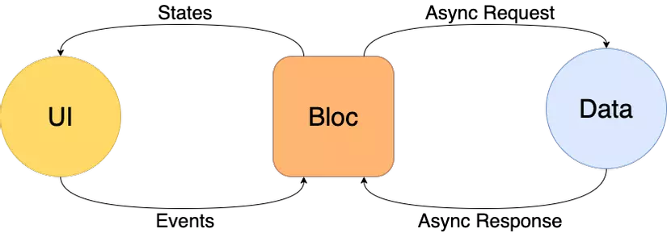

# GETX & BLOC

## I. GetX

[getX](https://viblo.asia/p/getx-flutter-multiple-language-support-with-getx-part-3-GrLZDDqBZk0)

>getX: MVC

>Bloc: MVP

`GetX` là một thư viện mạnh mẽ dành cho Flutter, giúp đơn giản hóa các tác vụ phổ biến như quản lý trạng thái, điều hướng, quản lý chủ đề và hỗ trợ đa ngôn ngữ. 
### 1. State Management – Cách quản lý State

[GetBuilder](https://baoflutter.com/getx-flutter-state-management-cach-quan-ly-state/)

[OBX](https://baoflutter.com/getx-flutter-state-management-cach-quan-ly-state-voi-obx/)

**Khai báo thư viện**

```dart
  get: ^4.1.4
```

Quản lý trạng thái là một phần quan trọng trong phát triển ứng dụng. GetX cung cấp hai cách tiếp cận chính để quản lý trạng thái:

#### (1) Simple State Manager (Quản lý trạng thái đơn giản - sử dụng GetBuilder)

- Đây là phương pháp tối ưu nhất về hiệu suất, không cần sử dụng `Streams` hoặc `ChangeNotifier`.
- Dữ liệu được cập nhật ngay lập tức mà không cần thông báo sự kiện rườm rà.
- Sử dụng `widget GetBuilder` để lắng nghe thay đổi và cập nhật UI khi cần.

**Ưu điểm:**

- Hiệu suất cao, chỉ **rebuild** khi cần.
- Không cần dùng **ChangeNotifier** hoặc **setState()**.
- Tối ưu tài nguyên, chỉ cập nhật **widget** cần thiết.

```dart
import 'package:flutter/material.dart';
import 'package:get/get.dart';

class CounterController extends GetxController {
  int count = 0;

  void increment() {
    count++;
    update(); // update UI
  }
}

void main() {
  runApp(MyApp());
}

class MyApp extends StatelessWidget {
  const MyApp({super.key});

  @override
  Widget build(BuildContext context) {
    return GetMaterialApp(
      // thay thế MaterialApp giúp sử dụng GetX Navigation.
      home: HomeScreen(),
    );
  }
}

class HomeScreen extends StatelessWidget {
  final CounterController controller = Get.put(CounterController());

  @override
  Widget build(BuildContext context) {
    return Scaffold(
      appBar: AppBar(
        title: const Text('GetX'),
        backgroundColor: Colors.blue,
      ),
      body: Center(
        child: GetBuilder<CounterController>(
          builder: (controller) => Text(
            'Count: ${controller.count}',
            style: const TextStyle(fontSize: 24),
          ),
        ),
      ),
      floatingActionButton: FloatingActionButton(
        onPressed: controller.increment,
        child: const Icon(Icons.add),
      ),
    );
  }
}
```

#### (2) Reactive State Manager (Quản lý trạng thái phản ứng - sử dụng Obx)

- Sử dụng `.obs` để tạo biến phản ứng.
- UI sẽ tự động cập nhật khi giá trị thay đổi mà không cần gọi `update()`.
- Sử dụng widget `Obx` để lắng nghe thay đổi.
- `Rx` : Theo dõi thay đổi của biến. (RxString, RxInt, RxDouble, RxBool…)

```dart
import 'package:flutter/material.dart';
import 'package:get/get.dart';

class CounterController extends GetxController {
  var count = 0.obs;

  void increment() {
    count++; // ko can update
  }
}

void main() {
  runApp(MyApp());
}

class MyApp extends StatelessWidget {
  const MyApp({super.key});

  @override
  Widget build(BuildContext context) {
    return GetMaterialApp(
      home: _HomeScreen(),
    );
  }
}

class _HomeScreen extends StatelessWidget {
  final CounterController counterController = Get.put(CounterController());

  @override
  Widget build(BuildContext context) {
    return Scaffold(
      appBar: AppBar(
        title: const Text('GetX'),
        backgroundColor: Colors.redAccent,
      ),
      body: Center(
        child: Obx(
          () => Text(
            'Count: ${counterController.count}',
            style: const TextStyle(fontSize: 24),
          ),
        ),
      ),
      floatingActionButton: FloatingActionButton(
        onPressed: counterController.increment,
        child: const Icon(Icons.add),
      ),
    );
  }
}
```

 **Ưu điểm:**

- Tự động cập nhật UI, không cần update().
- Dễ dàng sử dụng cho dữ liệu thay đổi liên tục.
- Hiệu suất cao, chỉ cập nhật widget chứa Obx.


> ==> Obx

### 2. Điều hướng (Navigation) trong GetX


```dart
import 'package:flutter/material.dart';
import 'package:get/get.dart';

void main() {
  runApp(MyApp());
}

class MyApp extends StatelessWidget {
  @override
  Widget build(BuildContext context) {
    return GetMaterialApp(
      debugShowCheckedModeBanner: false,
      title: 'GetX Navigation Demo',
      home: HomeScreen(),
    );
  }
}

class HomeScreen extends StatelessWidget {
  @override
  Widget build(BuildContext context) {
    return Scaffold(
      appBar: AppBar(title: Text('Home Screen')),
      body: Center(
        child: Column(
          mainAxisAlignment: MainAxisAlignment.center,
          children: [
            ElevatedButton(
              onPressed: () =>
                  Get.to(SecondScreen()), // Chuyển đến màn hình thứ hai
              child: Text('Go to Second Screen'),
            ),
            SizedBox(height: 10),
            ElevatedButton(
              onPressed: () => Get.to(SecondScreen(),
                  arguments:
                      'Hello from Home'), // Truyền dữ liệu qua Get.arguments
              child: Text('Go to Second Screen with Data'),
            ),
          ],
        ),
      ),
    );
  }
}

class SecondScreen extends StatelessWidget {
  @override
  Widget build(BuildContext context) {
    // Nhận dữ liệu từ màn hình trước (nếu có)
    final String? data = Get.arguments;

    return Scaffold(
      appBar: AppBar(title: Text('Second Screen')),
      body: Center(
        child: Column(
          mainAxisAlignment: MainAxisAlignment.center,
          children: [
            if (data != null) // Hiển thị dữ liệu nếu có
              Text('Received: $data', style: TextStyle(fontSize: 18)),
            SizedBox(height: 10),
            ElevatedButton(
              onPressed: () =>
                  Get.to(ThirdScreen()), // Chuyển đến màn hình thứ ba
              child: Text('Go to Third Screen'),
            ),
            SizedBox(height: 10),
            ElevatedButton(
              onPressed: () =>
                  Get.off(ThirdScreen()), // Xóa màn hình hiện tại khỏi stack
              child: Text('Go to Third Screen (Replace)'),
            ),
            SizedBox(height: 10),
            ElevatedButton(
              onPressed: () => Get.offAll(
                  HomeScreen()), // Xóa tất cả màn hình trước và quay về Home
              child: Text('Back to Home (Clear All)'),
            ),
          ],
        ),
      ),
    );
  }
}

class ThirdScreen extends StatelessWidget {
  @override
  Widget build(BuildContext context) {
    return Scaffold(
      appBar: AppBar(title: Text('Third Screen')),
      body: Center(
        child: Column(
          mainAxisAlignment: MainAxisAlignment.center,
          children: [
            Text('This is the Third Screen', style: TextStyle(fontSize: 18)),
            SizedBox(height: 10),
            ElevatedButton(
              onPressed: () => Get.back(), // Quay lại màn hình trước
              child: Text('Back to Previous Screen'),
            ),
          ],
        ),
      ),
    );
  }
}

```
### 3. Chủ đề (Themes) trong GetX

`GetX` giúp quản lý và thay đổi chủ đề (Theme) động trong ứng dụng Flutter một cách dễ dàng, không cần phải viết quá nhiều code phức tạp như cách truyền thống.

**Lợi ích:**

- Không cần `setState()` để thay đổi theme.
- Có thể thay đổi theme bất cứ lúc nào mà không cần restart ứng dụng.
- Hỗ trợ cả chế độ sáng **(Light Mode)** và tối **(Dark Mode)**.
- Cho phép tùy chỉnh theme dễ dàng với `GetX`.

**Tính năng**

- `Get.put()`: Khởi tạo 1 Controller
- `Get.find()`: Lấy lại một Controller đã khởi tạo

- `Get.changeTheme()`: Chuyển đổi theme	
- `Get.isDarkMode`: Kiểm tra chế độ Dark Mode	


```dart
import 'package:flutter/material.dart';
import 'package:get/get.dart';

class CounterController extends GetxController {
  var count = 0.obs;

  void increment() {
    count++; // ko can update
  }
}

void main() {
  runApp(MyApp());
}

class MyApp extends StatelessWidget {
  const MyApp({super.key});

  @override
  Widget build(BuildContext context) {
    return GetMaterialApp(
      home: _HomeScreen(),
    );
  }
}

class _HomeScreen extends StatelessWidget {
  final CounterController counterController = Get.put(CounterController());

  @override
  Widget build(BuildContext context) {
    return Scaffold(
      appBar: AppBar(
        title: const Text('GetX'),
        backgroundColor: Colors.redAccent,
      ),
      body: Center(
        child: Obx(
          () => Text(
            'Count: ${counterController.count}',
            style: const TextStyle(fontSize: 24),
          ),
        ),
      ),
      floatingActionButton: FloatingActionButton(
        onPressed: counterController.increment,
        child: const Icon(Icons.add),
      ),
    );
  }
}
```

### 4. Hỗ trợ đa ngôn ngữ (Localizations) trong GetX

**Lợi ích:**

- Không cần cấu hình phức tạp như MaterialApp truyền thống.
- Dễ dàng thay đổi ngôn ngữ ngay lập tức mà không cần restart ứng dụng.
- Có thể lấy ngôn ngữ mặc định của thiết bị bằng `Get.deviceLocale`.

**Tính năng**


```dart
import 'package:flutter/material.dart';
import 'package:get/get.dart';

void main() {
  runApp(MyApp());
}

class LanguageController extends GetxController {
  var locale = Locale('en', 'US');

  void changeLanguage(String languageCode) {
    locale = Locale(languageCode);
    Get.updateLocale(locale);
    update(); // Cập nhật UI khi thay đổi ngôn ngữ
  }
}

class MyApp extends StatelessWidget {
  final LanguageController languageController = Get.put(LanguageController());

  @override
  Widget build(BuildContext context) {
    return GetMaterialApp(
      debugShowCheckedModeBanner: false,
      title: 'GetX Localization',
      translations: AppTranslations(),
      locale: Get.deviceLocale, // Lấy ngôn ngữ mặc định của thiết bị
      fallbackLocale: Locale(
          'en', 'US'), // Nếu không có ngôn ngữ phù hợp, sẽ dùng tiếng Anh
      home: HomeScreen(),
    );
  }
}

class AppTranslations extends Translations {
  @override
  Map<String, Map<String, String>> get keys => {
        'en_US': {
          'hello': 'Hello!',
          'change_language': 'Change Language',
        },
        'vi_VN': {
          'hello': 'Xin chào!',
          'change_language': 'Thay đổi ngôn ngữ',
        },
      };
}

class HomeScreen extends StatelessWidget {
  final LanguageController languageController = Get.find();

  @override
  Widget build(BuildContext context) {
    return Scaffold(
      appBar: AppBar(title: Text('GetX Localization')),
      body: Center(
        child: Column(
          mainAxisAlignment: MainAxisAlignment.center,
          children: [
            Text('hello'.tr,
                style: TextStyle(
                    fontSize: 24)), // Hiển thị văn bản theo ngôn ngữ hiện tại
            SizedBox(height: 20),
            ElevatedButton(
              onPressed: () {
                languageController.changeLanguage(
                    Get.locale!.languageCode == 'en' ? 'vi' : 'en');
              },
              child: Text('change_language'.tr),
            ),
          ],
        ),
      ),
    );
  }
}
```
## II. BloC 

### 1. BloC Flutter là gì?

[bloc](https://itviec.com/blog/bloc-flutter-la-gi/#Uu_diem_cua_BloC_Pattern)

**Định nghĩa:** 

`Bloc` là một thành phần hoặc lớp trong ứng dụng có nhiệm vụ xử lý logic nghiệp vụ (business logic). Nó tách biệt rõ ràng phần logic nghiệp vụ khỏi giao diện người dùng (UI), đảm bảo rằng UI chỉ cần lắng nghe và hiển thị trạng thái mà `Bloc` trả về.

Đây là một mẫu thiết kế do Google tạo ra để tách biệt logic nghiệp vụ khỏi UI trong ứng dụng Flutter, sử dụng streams để quản lý luồng dữ liệu và sự kiện.

`Bloc Pattern` là một kiểu mẫu (design pattern) giúp tổ chức và quản lý trạng thái trong ứng dụng. Bloc Pattern cung cấp một cách thức tách biệt giữa logic nghiệp vụ và giao diện người dùng, nơi giao diện người dùng chỉ cần lắng nghe trạng thái và phản ứng với nó, thay vì quản lý trực tiếp logic.


Các thành phần trong `BloC Pattern` bao gồm 
- `Event` (sự kiên), 
- `State` (trạng thái), 
- `Stream` (Dòng dữ  liệu),



#### 1.1 Khái niệm Event trong BloC Flutter

`Event` trong kiến trúc BloC là một đối tượng đơn giản mô tả một hành động hoặc sự kiện mà người dùng hoặc hệ thống kích hoạt. Nó đóng vai trò là một thông điệp gửi đến BloC để yêu cầu thực hiện một hành động cụ thể.

**Tính chất và vai trò của Event:**

- **Đơn giản**: Event thường được định nghĩa là một class hoặc enum với các trường dữ liệu cần thiết để mô tả sự kiện.

- **Không chứa logic**: Event chỉ chứa thông tin về sự kiện, không chứa bất kỳ logic xử lý nào.

- **Cầu nối**: Event đóng vai trò là cầu nối giữa giao diện người dùng (UI) và logic nghiệp vụ (BloC). Khi người dùng thực hiện một hành động trên giao diện (ví dụ: nhấn nút, nhập liệu), một event tương ứng sẽ được tạo ra và gửi đến BloC.

- **Kích hoạt state**: Khi BloC nhận được một event, nó sẽ thực hiện các xử lý cần thiết và phát ra một state mới để cập nhật giao diện.

#### 1.2: State: Trạng thái

**Định nghĩa**: State là một đối tượng mô tả trạng thái hiện tại của một phần hoặc toàn bộ ứng dụng tại một thời điểm cụ thể. Trong ngữ cảnh của Bloc, state được sử dụng để phản ánh những thay đổi trong dữ liệu hoặc giao diện người dùng.

**Vai trò**:
- **Cập nhật giao diện**: Khi state thay đổi, các widget sẽ tự động rebuild để phản ánh những thay đổi đó.
- **Lưu trữ dữ liệu**: State có thể lưu trữ các dữ liệu cần thiết cho việc hiển thị và tương tác với ứng dụng.
- **Truyền dữ liệu**: State được truyền từ Bloc đến các widget để cập nhật giao diện.

#### 1.3 Stream: Dòng dữ liệu

**Định nghĩa**: Stream là một chuỗi các dữ liệu phát ra theo thời gian. Trong ngữ cảnh của Bloc, stream được sử dụng để truyền tải các state từ Bloc đến các widget.

 **Vai trò:**
- **Truyền tải dữ liệu**: Stream cho phép truyền tải dữ liệu một cách hiệu quả và phản ứng.
- **Cập nhật UI**: Các widget lắng nghe stream của Bloc để nhận các state mới và cập nhật giao diện.

**Ví dụ:**

**Ứng dụng chat:** Stream được sử dụng để truyền tải các tin nhắn mới từ server đến ứng dụng, giúp cho giao diện chat luôn được cập nhật.

### 2. Sơ đồ hoạt động của BloC Flutter


### 3. Ưu điểm của Bloc Pattern

- **Tách biệt rõ ràng**: Tách biệt rõ ràng giữa logic nghiệp vụ và UI.
- **Dễ kiểm thử**: Logic nghiệp vụ có thể được kiểm thử riêng biệt với UI.
- **Khả năng mở rộng**: Dễ mở rộng ứng dụng bằng cách thêm tính năng mới mà không ảnh hưởng đến chức năng hiện tại.
- **Dễ bảo trì**: Dễ bảo trì do thay đổi trong logic nghiệp vụ không ảnh hưởng đến UI và ngược lại.

### 4. Cách triển khai BloC Flutter


`equatable` là một thư viện trong Dart được sử dụng để so sánh các đối tượng một cách hiệu quả và dễ dàng hơn. Thư viện này giúp bạn không phải tự viết các phương thức == (so sánh đối tượng) và hashCode cho mỗi lớp trong ứng dụng của bạn, mà thay vào đó, thư viện sẽ tự động xử lý việc so sánh các đối tượng dựa trên các thuộc tính của chúng.

```dart
  flutter_bloc: ^8.0.1
  equatable: ^2.0.3
```

## III. Các widget của bloc

[widget](https://bloclibrary.dev/flutter-bloc-concepts/#multiblocprovider)

### 1. BlocBuilder

- `BlocBuilder` là một widget trong Flutter yêu cầu một Bloc và một hàm builder. Nó xây dựng lại widget khi có sự thay đổi trạng thái.
- Giống như `StreamBuilder`, nhưng API của nó đơn giản hơn, giảm thiểu mã thừa. Hàm builder sẽ được gọi nhiều lần và phải là một hàm thuần túy trả về widget theo trạng thái.

```dart
BlocBuilder<BlocA, BlocAState>(
  builder: (context, state) {
    // return widget here based on BlocA's state
  },
);
```

- Có thể sử dụng `buildWhen` để kiểm soát khi nào builder được gọi, dựa trên sự thay đổi của trạng thái.

```dart
BlocBuilder<BlocA, BlocAState>(
  buildWhen: (previousState, state) {
    // return true/false to determine whether or not
    // to rebuild the widget with state
  },
  builder: (context, state) {
    // return widget here based on BlocA's state
  },
);
```
- `buildWhenlấy` trạng thái khối trước đó và trạng thái khối hiện tại và trả về giá trị boolean. 
  - Nếu `buildWhentrả` về **true**, `builder` sẽ được gọi bằng `state` và tiện ích sẽ xây dựng lại.
  - Nếu `buildWhen` trả về **false**, `builder` sẽ không được gọi bằng `state` và không có quá trình xây dựng lại nào xảy ra.


### 2. BlocSelector 

- `BlocSelector` là một widget trong Flutter tương tự như `BlocBuilder`, nhưng cho phép người phát triển lọc các cập nhật trạng thái bằng cách chọn một giá trị mới từ trạng thái hiện tại của bloc.
-  Điều này giúp ngăn ngừa việc xây dựng lại widget không cần thiết nếu giá trị đã chọn không thay đổi.
- Giá trị được chọn phải là bất biến để `BlocSelector` có thể xác định chính xác khi nào builder cần được gọi lại.

```dart
BlocSelector<BlocA, BlocAState, SelectedState>(
  selector: (state) {
    // return selected state based on the provided state.
  },
  builder: (context, state) {
    // return widget here based on the selected state.
  },
);
```

### 3. BlocProvider
`BlocProvider` là một widget trong Flutter được sử dụng để cung cấp một instance của Bloc cho các widget con thông qua phương thức `BlocProvider.of<T>(context)`.

Trong hầu hết các trường hợp, `BlocProvider` sẽ được sử dụng để tạo một instance mới của Bloc, instance này sẽ được cung cấp cho các widget con trong cây widget.

Vì `BlocProvider` chịu trách nhiệm tạo ra `Bloc`, nó sẽ tự động quản lý vòng đời của `Bloc`, bao gồm cả việc đóng (close) `Bloc` khi không còn cần thiết nữa.

```dart
BlocProvider(
  create: (BuildContext context) => BlocA(),
  child: ChildA(),
);
```

**Truy xuất Bloc trong widget con**

```dart
// with extensions
context.read<BlocA>();

// without extensions
BlocProvider.of<BlocA>(context);
```

### 4. MultiBlocProvider

`MultiBlocProvider` là một widget trong Flutter giúp gộp nhiều widget BlocProvider thành một. 

`MultiBlocProvider` cải thiện tính dễ đọc của mã nguồn và loại bỏ việc phải lồng nhiều BlocProvider vào nhau. 

Thay vì viết như sau:

```dart
BlocProvider<BlocA>(
  create: (BuildContext context) => BlocA(),
  child: BlocProvider<BlocB>(
    create: (BuildContext context) => BlocB(),
    child: BlocProvider<BlocC>(
      create: (BuildContext context) => BlocC(),
      child: ChildA(),
    ),
  ),
);
```
sử dụng `MultiBlocProvider`:

```dart
MultiBlocProvider(
  providers: [
    BlocProvider<BlocA>(
      create: (BuildContext context) => BlocA(),
    ),
    BlocProvider<BlocB>(
      create: (BuildContext context) => BlocB(),
    ),
    BlocProvider<BlocC>(
      create: (BuildContext context) => BlocC(),
    ),
  ],
  child: ChildA(),
);
```
### Ví dụ BlocBuilder, BlocProvider

```Dart
abstract class CounterEvent {}

class IncreaseEvent extends CounterEvent {}

class DecreaseEvent extends CounterEvent {}
```

```dart
import 'package:flutter_bloc/flutter_bloc.dart';
import 'package:untitled/vd_bloc/counter_event.dart';

class CounterBloc extends Bloc<CounterEvent, int> {
  CounterBloc() : super(0) {
    on<IncreaseEvent>((event, emit) => _increase(emit));
    on<DecreaseEvent>((event, emit) => _decrease(emit));
  }
  _increase(Emitter emit) {
    emit(state + 1);
  }

  _decrease(Emitter emit) {
    emit(state - 1);
  }
}
```

```dart
import 'package:flutter/material.dart';
import 'package:flutter_bloc/flutter_bloc.dart';
import 'package:untitled/vd_bloc/counter_bloc.dart';

class CounterProvider extends StatelessWidget {
  const CounterProvider({super.key, required this.child});
  final Widget child;

  @override
  Widget build(BuildContext context) {
    return BlocProvider(
      create: (BuildContext context) => CounterBloc(),
      child: child,
    );
  }
}
```

```dart
import 'package:flutter/material.dart';
import 'package:flutter_bloc/flutter_bloc.dart';
import 'package:untitled/vd_bloc/counter_bloc.dart';
import 'package:untitled/vd_bloc/counter_provider.dart';

import 'counter_event.dart';

class CounterPage extends StatefulWidget {
  const CounterPage({super.key});

  @override
  State<CounterPage> createState() => _CounterPageState();
}

class _CounterPageState extends State<CounterPage> {
  @override
  Widget build(BuildContext context) {
    return CounterProvider(
      child: Scaffold(
        appBar: AppBar(
          title: const Text('Bloc Counter'),
        ),
        body: Center(
          child: BlocBuilder<CounterBloc, int>(
            builder: (context, state) {
              return Column(
                mainAxisAlignment: MainAxisAlignment.center,
                children: [
                  Text(
                    'Count: $state',
                    style: const TextStyle(fontSize: 30),
                  ),
                  Row(
                    mainAxisAlignment: MainAxisAlignment.center,
                    children: [
                      IconButton(
                        icon: Icon(Icons.add),
                        onPressed: () {
                          context.read<CounterBloc>().add(IncreaseEvent());
                        },
                      ),
                      IconButton(
                        icon: const Icon(Icons.remove),
                        onPressed: () {
                          context.read<CounterBloc>().add(DecreaseEvent());
                        },
                      ),
                    ],
                  ),
                ],
              );
            },
          ),
        ),
      ),
    );
  }
}

import 'package:flutter/material.dart%20';

import 'counter_page.dart';

void main() {
  runApp(MyApp());
}

class MyApp extends StatelessWidget {
  @override
  Widget build(BuildContext context) {
    return MaterialApp(
      title: 'Flutter Bloc Example',
      theme: ThemeData(
        primarySwatch: Colors.blue,
      ),
      home: const CounterPage(),
    );
  }
}

```
